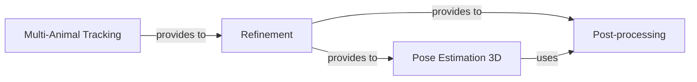

## Details

The `Advanced Analysis & Post-processing` subsystem is crucial for transforming raw pose estimation outputs into refined, accurate, and insightful behavioral data. It encompasses several key stages, including multi-animal identity management, data cleaning, 3D reconstruction, and general data enhancement. This modular design aligns with the project's emphasis on a pipeline-driven and data-centric architecture, ensuring that each step of data refinement is handled by specialized, decoupled components.

### Multi-Animal Tracking

This component is responsible for maintaining individual identities across frames in multi-animal scenarios. It includes functionalities for training and inference of re-identification models (e.g., DLCTrans), creating tracking datasets, and preprocessing tracking data. Its purpose is to enable the analysis of complex social behaviors by ensuring consistent individual identification.

**Related Classes/Methods**:

- <a href="https://github.com/DeepLabCut/DeepLabCut/blob/main/deeplabcut/pose_tracking_pytorch/apis.py" target="_blank" rel="noopener noreferrer">`deeplabcut/pose_tracking_pytorch/apis.py`</a>

- <a href="https://github.com/DeepLabCut/DeepLabCut/blob/main/deeplabcut/pose_tracking_pytorch/create_dataset.py" target="_blank" rel="noopener noreferrer">`deeplabcut/pose_tracking_pytorch/create_dataset.py`</a>

- <a href="https://github.com/DeepLabCut/DeepLabCut/blob/main/deeplabcut/pose_tracking_pytorch/tracking_utils/preprocessing.py" target="_blank" rel="noopener noreferrer">`deeplabcut/pose_tracking_pytorch/tracking_utils/preprocessing.py`</a>

- <a href="https://github.com/DeepLabCut/DeepLabCut/blob/main/deeplabcut/pose_tracking_pytorch/train_dlctransreid.py" target="_blank" rel="noopener noreferrer">`deeplabcut/pose_tracking_pytorch/train_dlctransreid.py`</a>

- <a href="https://github.com/DeepLabCut/DeepLabCut/blob/main/deeplabcut/pose_tracking_pytorch/inference.py" target="_blank" rel="noopener noreferrer">`deeplabcut/pose_tracking_pytorch/inference.py`</a>

### Refinement

This component focuses on improving the quality and continuity of pose estimation and tracking data. It identifies and corrects outlier frames (e.g., using statistical models like SARIMAX) and stitches fragmented tracklets to ensure smooth and accurate trajectories for each individual. This is vital for downstream analysis accuracy.

**Related Classes/Methods**:

- <a href="https://github.com/DeepLabCut/DeepLabCut/blob/main/deeplabcut/refine_training_dataset/outlier_frames.py" target="_blank" rel="noopener noreferrer">`deeplabcut/refine_training_dataset/outlier_frames.py`</a>

- <a href="https://github.com/DeepLabCut/DeepLabCut/blob/main/deeplabcut/refine_training_dataset/tracklets.py" target="_blank" rel="noopener noreferrer">`deeplabcut/refine_training_dataset/tracklets.py`</a>

- <a href="https://github.com/DeepLabCut/DeepLabCut/blob/main/deeplabcut/refine_training_dataset/stitch.py" target="_blank" rel="noopener noreferrer">`deeplabcut/refine_training_dataset/stitch.py`</a>

### Post-processing [[Expand]](./Post_processing.md)

This component provides general post-processing functionalities for the pose estimation results. This includes applying various filters to smooth trajectories, correcting minor errors, and analyzing the skeleton (e.g., calculating bone lengths or angles) to derive higher-level behavioral metrics. It serves as a versatile tool for data enhancement.

**Related Classes/Methods**:

- <a href="https://github.com/DeepLabCut/DeepLabCut/blob/main/deeplabcut/post_processing/analyze_skeleton.py" target="_blank" rel="noopener noreferrer">`deeplabcut/post_processing/analyze_skeleton.py`</a>

- <a href="https://github.com/DeepLabCut/DeepLabCut/blob/main/deeplabcut/post_processing/filtering.py" target="_blank" rel="noopener noreferrer">`deeplabcut/post_processing/filtering.py`</a>

### Pose Estimation 3D

This component specializes in reconstructing 3D poses from 2D estimations, which is essential for depth perception and more accurate spatial analysis. It handles multi-view camera calibration, triangulating 2D keypoints into 3D coordinates, and visualizing the reconstructed 3D poses.

**Related Classes/Methods**:

- <a href="https://github.com/DeepLabCut/DeepLabCut/blob/main/deeplabcut/pose_estimation_3d/camera_calibration.py" target="_blank" rel="noopener noreferrer">`deeplabcut/pose_estimation_3d/camera_calibration.py`</a>

- <a href="https://github.com/DeepLabCut/DeepLabCut/blob/main/deeplabcut/pose_estimation_3d/plotting3D.py" target="_blank" rel="noopener noreferrer">`deeplabcut/pose_estimation_3d/plotting3D.py`</a>

- <a href="https://github.com/DeepLabCut/DeepLabCut/blob/main/deeplabcut/pose_estimation_3d/triangulation.py" target="_blank" rel="noopener noreferrer">`deeplabcut/pose_estimation_3d/triangulation.py`</a>

### [FAQ](https://github.com/CodeBoarding/GeneratedOnBoardings/tree/main?tab=readme-ov-file#faq)