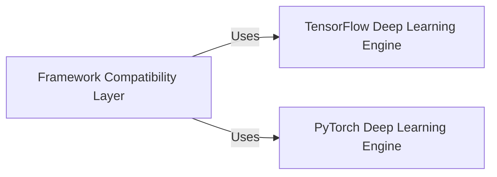

## Details

The `Core Deep Learning Engine` subsystem in DeepLabCut is designed to abstract the complexities of underlying deep learning frameworks (TensorFlow/PyTorch) while providing robust capabilities for neural network model definition, training, inference (pose prediction), and internal evaluation. This modular design adheres to the project's emphasis on decoupling high-level application flow from specific deep learning implementations.

### Framework Compatibility Layer

This component acts as a crucial abstraction layer, offering a unified interface for the rest of the DeepLabCut application to interact seamlessly with either the TensorFlow or PyTorch deep learning backends. It encapsulates framework-specific calls, allowing for flexible switching between implementations without altering higher-level logic.

**Related Classes/Methods**:

- <a href="https://github.com/DeepLabCut/DeepLabCut/blob/main/deeplabcut/compat.py#L657-L975" target="_blank" rel="noopener noreferrer">`deeplabcut.compat.analyze_videos` (657:975)</a>

- <a href="https://github.com/DeepLabCut/DeepLabCut/blob/main/deeplabcut/compat.py#L978-L1108" target="_blank" rel="noopener noreferrer">`deeplabcut.compat.create_tracking_dataset` (978:1108)</a>

- <a href="https://github.com/DeepLabCut/DeepLabCut/blob/main/deeplabcut/compat.py#L310-L373" target="_blank" rel="noopener noreferrer">`deeplabcut.compat.return_train_network_path` (310:373)</a>

### TensorFlow Deep Learning Engine

This component is the dedicated computational engine for all deep learning operations performed using the TensorFlow framework. It encompasses the definition, training, and inference of neural network models for pose estimation, along with utilities for dataset management and model configuration specific to TensorFlow.

**Related Classes/Methods**:

- <a href="https://github.com/DeepLabCut/DeepLabCut/blob/main/deeplabcut/pose_estimation_tensorflow/nnets/base.py#L18-L245" target="_blank" rel="noopener noreferrer">`deeplabcut.pose_estimation_tensorflow.nnets.base.BasePoseNet` (18:245)</a>

- <a href="https://github.com/DeepLabCut/DeepLabCut/blob/main/deeplabcut/pose_estimation_tensorflow/datasets/pose_base.py#L16-L36" target="_blank" rel="noopener noreferrer">`deeplabcut.pose_estimation_tensorflow.datasets.pose_base.BasePoseDataset` (16:36)</a>

- <a href="https://github.com/DeepLabCut/DeepLabCut/blob/main/deeplabcut/pose_estimation_tensorflow/core/train.py#L146-L313" target="_blank" rel="noopener noreferrer">`deeplabcut.pose_estimation_tensorflow.core.train` (146:313)</a>

- <a href="https://github.com/DeepLabCut/DeepLabCut/blob/main/deeplabcut/pose_estimation_tensorflow/core/predict.py" target="_blank" rel="noopener noreferrer">`deeplabcut.pose_estimation_tensorflow.core.predict`</a>

### PyTorch Deep Learning Engine

This component provides the core deep learning functionalities for model definition, training, and inference within the PyTorch framework. It includes a comprehensive set of APIs for various deep learning tasks, modules for data handling (preprocessing, post-processing), diverse model architectures (backbones, heads, loss functions), and runners to orchestrate training and inference workflows.

**Related Classes/Methods**:

- <a href="https://github.com/DeepLabCut/DeepLabCut/blob/main/deeplabcut/pose_estimation_pytorch/models/model.py#L32-L239" target="_blank" rel="noopener noreferrer">`deeplabcut.pose_estimation_pytorch.models.model.PoseModel` (32:239)</a>

- <a href="https://github.com/DeepLabCut/DeepLabCut/blob/main/deeplabcut/pose_estimation_pytorch/models/backbones/base.py#L26-L83" target="_blank" rel="noopener noreferrer">`deeplabcut.pose_estimation_pytorch.models.backbones.base.BaseBackbone` (26:83)</a>

- <a href="https://github.com/DeepLabCut/DeepLabCut/blob/main/deeplabcut/pose_estimation_pytorch/models/heads/base.py#L32-L140" target="_blank" rel="noopener noreferrer">`deeplabcut.pose_estimation_pytorch.models.heads.base.BaseHead` (32:140)</a>

- <a href="https://github.com/DeepLabCut/DeepLabCut/blob/main/deeplabcut/pose_estimation_pytorch/models/criterions/base.py#L23-L40" target="_blank" rel="noopener noreferrer">`deeplabcut.pose_estimation_pytorch.models.criterions.base.BaseCriterion` (23:40)</a>

- <a href="https://github.com/DeepLabCut/DeepLabCut/blob/main/deeplabcut/pose_estimation_pytorch/data/base.py#L36-L372" target="_blank" rel="noopener noreferrer">`deeplabcut.pose_estimation_pytorch.data.base.Loader` (36:372)</a>

- <a href="https://github.com/DeepLabCut/DeepLabCut/blob/main/deeplabcut/pose_estimation_pytorch/runners/base.py#L51-L117" target="_blank" rel="noopener noreferrer">`deeplabcut.pose_estimation_pytorch.runners.base.Runner` (51:117)</a>

- <a href="https://github.com/DeepLabCut/DeepLabCut/blob/main/deeplabcut/pose_estimation_pytorch/apis/training.py" target="_blank" rel="noopener noreferrer">`deeplabcut.pose_estimation_pytorch.apis.training`</a>

- <a href="https://github.com/DeepLabCut/DeepLabCut/blob/main/deeplabcut/pose_estimation_pytorch/apis/analyze_images.py#L217-L382" target="_blank" rel="noopener noreferrer">`deeplabcut.pose_estimation_pytorch.apis.analyze_images` (217:382)</a>

- <a href="https://github.com/DeepLabCut/DeepLabCut/blob/main/deeplabcut/pose_estimation_pytorch/apis/videos.py" target="_blank" rel="noopener noreferrer">`deeplabcut.pose_estimation_pytorch.apis.videos`</a>

### [FAQ](https://github.com/CodeBoarding/GeneratedOnBoardings/tree/main?tab=readme-ov-file#faq)