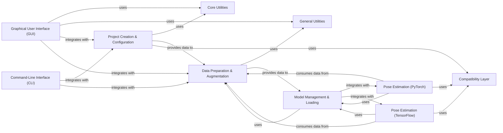

## Details

This component is central to managing the entire lifecycle of a DeepLabCut project, from initial setup to data preparation for model training. It adheres to the project's architectural biases by providing a modular, pipeline-driven, and data-centric approach, ensuring a clear separation of concerns and configurability.

### Project Creation & Configuration

This component handles the initial setup of new DeepLabCut projects, including both 2D and 3D variants. It manages project-specific configurations, such as defining body parts, creating configuration files, and adding video files to the project.

**Related Classes/Methods**:

- `deeplabcut.create_project` (1:1)

- <a href="https://github.com/DeepLabCut/DeepLabCut/blob/main/deeplabcut/create_project/new.py#L1-L1" target="_blank" rel="noopener noreferrer">`deeplabcut.create_project.new` (1:1)</a>

- <a href="https://github.com/DeepLabCut/DeepLabCut/blob/main/deeplabcut/create_project/new_3d.py#L1-L1" target="_blank" rel="noopener noreferrer">`deeplabcut.create_project.new_3d` (1:1)</a>

- <a href="https://github.com/DeepLabCut/DeepLabCut/blob/main/deeplabcut/create_project/add.py#L1-L1" target="_blank" rel="noopener noreferrer">`deeplabcut.create_project.add` (1:1)</a>

### Data Preparation & Augmentation

This component is responsible for preparing the data for model training. This includes extracting frames from videos, managing and manipulating training datasets (e.g., splitting data, shuffling), and handling metadata associated with the datasets. It also supports multi-individual training set manipulation.

**Related Classes/Methods**:

- `deeplabcut.generate_training_dataset` (1:1)

- <a href="https://github.com/DeepLabCut/DeepLabCut/blob/main/deeplabcut/generate_training_dataset/frame_extraction.py#L1-L1" target="_blank" rel="noopener noreferrer">`deeplabcut.generate_training_dataset.frame_extraction` (1:1)</a>

- <a href="https://github.com/DeepLabCut/DeepLabCut/blob/main/deeplabcut/generate_training_dataset/trainingsetmanipulation.py#L1-L1" target="_blank" rel="noopener noreferrer">`deeplabcut.generate_training_dataset.trainingsetmanipulation` (1:1)</a>

- <a href="https://github.com/DeepLabCut/DeepLabCut/blob/main/deeplabcut/generate_training_dataset/metadata.py#L1-L1" target="_blank" rel="noopener noreferrer">`deeplabcut.generate_training_dataset.metadata` (1:1)</a>

- <a href="https://github.com/DeepLabCut/DeepLabCut/blob/main/deeplabcut/generate_training_dataset/multiple_individuals_trainingsetmanipulation.py#L1-L1" target="_blank" rel="noopener noreferrer">`deeplabcut.generate_training_dataset.multiple_individuals_trainingsetmanipulation` (1:1)</a>

### Model Management & Loading

This component provides functionalities for managing and loading pre-trained models, including utilities for model configuration and data conversion to a generalized format. It acts as a centralized repository for various pose estimation models.

**Related Classes/Methods**:

- `deeplabcut.modelzoo` (1:1)

- <a href="https://github.com/DeepLabCut/DeepLabCut/blob/main/deeplabcut/modelzoo/utils.py#L1-L1" target="_blank" rel="noopener noreferrer">`deeplabcut.modelzoo.utils` (1:1)</a>

- `deeplabcut.modelzoo.model_configs` (1:1)

- `deeplabcut.modelzoo.generalized_data_converter` (1:1)

### Core Utilities

This component encompasses core functionalities and utilities that are fundamental to the entire DeepLabCut application. This includes configuration management, engine functionalities, and basic tracking utilities.

**Related Classes/Methods**:

- <a href="https://github.com/DeepLabCut/DeepLabCut/blob/main/deeplabcut/core/config.py#L1-L1" target="_blank" rel="noopener noreferrer">`deeplabcut.core.config` (1:1)</a>

- <a href="https://github.com/DeepLabCut/DeepLabCut/blob/main/deeplabcut/core/engine.py#L1-L1" target="_blank" rel="noopener noreferrer">`deeplabcut.core.engine` (1:1)</a>

- <a href="https://github.com/DeepLabCut/DeepLabCut/blob/main/deeplabcut/core/trackingutils.py#L1-L1" target="_blank" rel="noopener noreferrer">`deeplabcut.core.trackingutils` (1:1)</a>

### General Utilities

This component provides a collection of general-purpose utility functions, including tools for video manipulation (reading, writing), frame selection, and other auxiliary functions that support various parts of the DeepLabCut workflow.

**Related Classes/Methods**:

- <a href="https://github.com/DeepLabCut/DeepLabCut/blob/main/deeplabcut/utils/auxfun_videos.py#L1-L1" target="_blank" rel="noopener noreferrer">`deeplabcut.utils.auxfun_videos` (1:1)</a>

- <a href="https://github.com/DeepLabCut/DeepLabCut/blob/main/deeplabcut/utils/frameselectiontools.py#L1-L1" target="_blank" rel="noopener noreferrer">`deeplabcut.utils.frameselectiontools` (1:1)</a>

- <a href="https://github.com/DeepLabCut/DeepLabCut/blob/main/deeplabcut/utils/video_processor.py#L1-L1" target="_blank" rel="noopener noreferrer">`deeplabcut.utils.video_processor` (1:1)</a>

### Graphical User Interface (GUI)

This component provides the graphical user interface for DeepLabCut, allowing users to interact with the application through various tabs and widgets. It encapsulates the visual presentation and user interaction logic.

**Related Classes/Methods**:

- <a href="https://github.com/DeepLabCut/DeepLabCut/blob/main/deeplabcut/gui/window.py#L1-L1" target="_blank" rel="noopener noreferrer">`deeplabcut.gui.window` (1:1)</a>

- `deeplabcut.gui.tabs` (1:1)

- <a href="https://github.com/DeepLabCut/DeepLabCut/blob/main/deeplabcut/gui/components.py#L1-L1" target="_blank" rel="noopener noreferrer">`deeplabcut.gui.components` (1:1)</a>

- <a href="https://github.com/DeepLabCut/DeepLabCut/blob/main/deeplabcut/gui/utils.py#L1-L1" target="_blank" rel="noopener noreferrer">`deeplabcut.gui.utils` (1:1)</a>

### Command-Line Interface (CLI)

This component provides a command-line interface for DeepLabCut, enabling users to automate workflows and integrate DeepLabCut into scripts. It exposes core functionalities as command-line commands.

**Related Classes/Methods**:

- <a href="https://github.com/DeepLabCut/DeepLabCut/blob/main/deeplabcut/cli.py#L1-L1" target="_blank" rel="noopener noreferrer">`deeplabcut.cli` (1:1)</a>

### Pose Estimation (PyTorch)

This component contains the core logic for pose estimation using the PyTorch deep learning framework. It includes models, data loaders, preprocessors, postprocessors, and training/inference runners specific to PyTorch.

**Related Classes/Methods**:

- `deeplabcut.pose_estimation_pytorch` (1:1)

### Pose Estimation (TensorFlow)

Similar to the PyTorch component, this handles pose estimation using the TensorFlow deep learning framework. It includes TensorFlow-specific models, datasets, and network architectures.

**Related Classes/Methods**:

- `deeplabcut.pose_estimation_tensorflow` (1:1)

### Compatibility Layer

This component (though not explicitly listed in the initial getClassHierarchy output, it's a common pattern in such frameworks) would handle compatibility issues between different versions of libraries or operating systems, ensuring smooth operation across various environments.

**Related Classes/Methods**:

- <a href="https://github.com/DeepLabCut/DeepLabCut/blob/main/deeplabcut/compat.py#L1-L1" target="_blank" rel="noopener noreferrer">`deeplabcut.compat` (1:1)</a>

### [FAQ](https://github.com/CodeBoarding/GeneratedOnBoardings/tree/main?tab=readme-ov-file#faq)