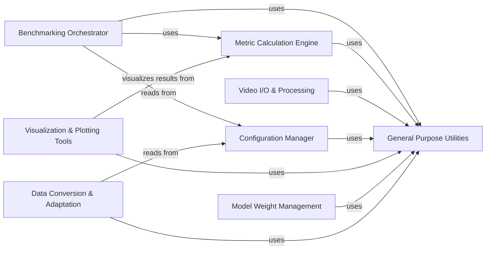

## Details

This foundational component provides a comprehensive set of reusable helper functions, common data structures, video I/O capabilities, file system interactions, configuration parsing, plotting functionalities, and dedicated tools for quantitatively assessing model performance. It underpins many other components by offering essential low-level services and critical evaluation mechanisms.

### Configuration Manager

Centralizes the management of project configuration, providing utilities for reading, writing, and modifying YAML-based settings. It ensures that the application's behavior is driven by external, persistent parameters, promoting flexibility and maintainability.

**Related Classes/Methods**:

- <a href="https://github.com/DeepLabCut/DeepLabCut/blob/main/deeplabcut/core/config.py" target="_blank" rel="noopener noreferrer">`deeplabcut.core.config`</a>

- <a href="https://github.com/DeepLabCut/DeepLabCut/blob/main/deeplabcut/utils/auxiliaryfunctions.py#L199-L240" target="_blank" rel="noopener noreferrer">`deeplabcut.utils.auxiliaryfunctions:read_config` (199:240)</a>

- <a href="https://github.com/DeepLabCut/DeepLabCut/blob/main/deeplabcut/utils/auxiliaryfunctions.py#L243-L258" target="_blank" rel="noopener noreferrer">`deeplabcut.utils.auxiliaryfunctions:write_config` (243:258)</a>

- <a href="https://github.com/DeepLabCut/DeepLabCut/blob/main/deeplabcut/utils/auxiliaryfunctions.py#L261-L300" target="_blank" rel="noopener noreferrer">`deeplabcut.utils.auxiliaryfunctions:edit_config` (261:300)</a>

### Video I/O & Processing

Handles all video-related operations, including efficient reading of frames, writing new videos, and performing basic manipulations like shortening, cropping, and resizing. It abstracts the complexities of underlying video file formats and codecs.

**Related Classes/Methods**:

- <a href="https://github.com/DeepLabCut/DeepLabCut/blob/main/deeplabcut/utils/auxfun_videos.py" target="_blank" rel="noopener noreferrer">`deeplabcut.utils.auxfun_videos`</a>

- <a href="https://github.com/DeepLabCut/DeepLabCut/blob/main/deeplabcut/utils/video_processor.py" target="_blank" rel="noopener noreferrer">`deeplabcut.utils.video_processor`</a>

### General Purpose Utilities

A foundational collection of widely applicable helper functions for file system interactions (e.g., path handling, directory creation), general data manipulation (e.g., array operations, data validation), multiprocessing, and common data structures (e.g., skeleton definitions). These utilities support various parts of the application, preventing code duplication.

**Related Classes/Methods**:

- <a href="https://github.com/DeepLabCut/DeepLabCut/blob/main/deeplabcut/utils/auxiliaryfunctions.py" target="_blank" rel="noopener noreferrer">`deeplabcut.utils.auxiliaryfunctions`</a>

- <a href="https://github.com/DeepLabCut/DeepLabCut/blob/main/deeplabcut/utils/frameselectiontools.py" target="_blank" rel="noopener noreferrer">`deeplabcut.utils.frameselectiontools`</a>

- <a href="https://github.com/DeepLabCut/DeepLabCut/blob/main/deeplabcut/utils/multiprocessing.py" target="_blank" rel="noopener noreferrer">`deeplabcut.utils.multiprocessing`</a>

- <a href="https://github.com/DeepLabCut/DeepLabCut/blob/main/deeplabcut/utils/skeleton.py" target="_blank" rel="noopener noreferrer">`deeplabcut.utils.skeleton`</a>

- <a href="https://github.com/DeepLabCut/DeepLabCut/blob/main/deeplabcut/utils/pseudo_label.py" target="_blank" rel="noopener noreferrer">`deeplabcut.utils.pseudo_label`</a>

### Metric Calculation Engine

Provides a comprehensive set of functions for quantitatively assessing model performance. It includes implementations for various metrics such as Root Mean Squared Error (RMSE), Object Keypoint Similarity (OKS), and mean Average Precision (mAP), which are crucial for evaluating pose estimation and tracking accuracy.

**Related Classes/Methods**:

- <a href="https://github.com/DeepLabCut/DeepLabCut/blob/main/deeplabcut/benchmark/metrics.py" target="_blank" rel="noopener noreferrer">`deeplabcut.benchmark.metrics`</a>

- <a href="https://github.com/DeepLabCut/DeepLabCut/blob/main/deeplabcut/core/metrics/api.py" target="_blank" rel="noopener noreferrer">`deeplabcut.core.metrics.api`</a>

- <a href="https://github.com/DeepLabCut/DeepLabCut/blob/main/deeplabcut/core/metrics/distance_metrics.py" target="_blank" rel="noopener noreferrer">`deeplabcut.core.metrics.distance_metrics`</a>

- <a href="https://github.com/DeepLabCut/DeepLabCut/blob/main/deeplabcut/core/metrics/matching.py" target="_blank" rel="noopener noreferrer">`deeplabcut.core.metrics.matching`</a>

- <a href="https://github.com/DeepLabCut/DeepLabCut/blob/main/deeplabcut/core/metrics/bbox.py" target="_blank" rel="noopener noreferrer">`deeplabcut.core.metrics.bbox`</a>

- <a href="https://github.com/DeepLabCut/DeepLabCut/blob/main/deeplabcut/core/metrics/identity.py" target="_blank" rel="noopener noreferrer">`deeplabcut.core.metrics.identity`</a>

### Benchmarking Orchestrator

Manages the end-to-end process of evaluating pose estimation models. It defines the workflow for loading predictions, validating data, invoking metric calculations, and managing benchmark results, serving as the central control for performance assessment.

**Related Classes/Methods**:

- <a href="https://github.com/DeepLabCut/DeepLabCut/blob/main/deeplabcut/benchmark/base.py" target="_blank" rel="noopener noreferrer">`deeplabcut.benchmark.base`</a>

- <a href="https://github.com/DeepLabCut/DeepLabCut/blob/main/deeplabcut/benchmark/benchmarks.py" target="_blank" rel="noopener noreferrer">`deeplabcut.benchmark.benchmarks`</a>

- <a href="https://github.com/DeepLabCut/DeepLabCut/blob/main/deeplabcut/benchmark/cli.py" target="_blank" rel="noopener noreferrer">`deeplabcut.benchmark.cli`</a>

### Visualization & Plotting Tools

Offers a versatile set of tools for generating visual representations of data and results. This includes plotting trajectories, score maps, and general evaluation outcomes, aiding in debugging, analysis, and understanding model behavior.

**Related Classes/Methods**:

- <a href="https://github.com/DeepLabCut/DeepLabCut/blob/main/deeplabcut/utils/plotting.py" target="_blank" rel="noopener noreferrer">`deeplabcut.utils.plotting`</a>

- <a href="https://github.com/DeepLabCut/DeepLabCut/blob/main/deeplabcut/utils/visualization.py" target="_blank" rel="noopener noreferrer">`deeplabcut.utils.visualization`</a>

- <a href="https://github.com/DeepLabCut/DeepLabCut/blob/main/deeplabcut/core/visualization.py" target="_blank" rel="noopener noreferrer">`deeplabcut.core.visualization`</a>

### Model Weight Management

Handles the lifecycle of model weights, including loading pre-trained models, checking their integrity, and facilitating their download. It ensures that the correct model parameters are available for inference and training.

**Related Classes/Methods**:

- <a href="https://github.com/DeepLabCut/DeepLabCut/blob/main/deeplabcut/utils/auxfun_models.py" target="_blank" rel="noopener noreferrer">`deeplabcut.utils.auxfun_models`</a>

- <a href="https://github.com/DeepLabCut/DeepLabCut/blob/main/deeplabcut/core/weight_init.py" target="_blank" rel="noopener noreferrer">`deeplabcut.core.weight_init`</a>

### Data Conversion & Adaptation

Provides utilities for transforming data between different internal and external formats (e.g., CSV to HDF5) and adapting labeled datasets to new project structures. This ensures data compatibility and flexibility within the DeepLabCut ecosystem.

**Related Classes/Methods**:

- <a href="https://github.com/DeepLabCut/DeepLabCut/blob/main/deeplabcut/utils/conversioncode.py" target="_blank" rel="noopener noreferrer">`deeplabcut.utils.conversioncode`</a>

### [FAQ](https://github.com/CodeBoarding/GeneratedOnBoardings/tree/main?tab=readme-ov-file#faq)