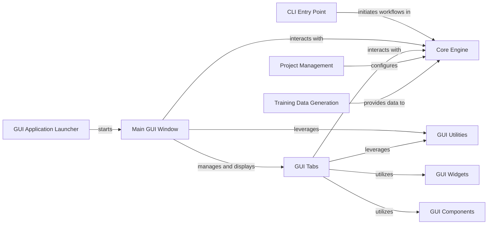

## Details

Abstract Components Overview for DeepLabCut

### CLI Entry Point

This component provides the command-line interface for DeepLabCut. It is responsible for parsing command-line arguments and dispatching calls to the appropriate core functionalities of the DeepLabCut engine. It allows users to automate workflows and integrate DeepLabCut into scripts.

**Related Classes/Methods**:

- <a href="https://github.com/DeepLabCut/DeepLabCut/blob/main/deeplabcut/cli.py" target="_blank" rel="noopener noreferrer">`deeplabcut.cli`</a>

### GUI Application Launcher

This component is the main entry point for the graphical user interface. It initializes the GUI environment and launches the MainWindow, setting up the visual application for user interaction.

**Related Classes/Methods**:

- <a href="https://github.com/DeepLabCut/DeepLabCut/blob/main/deeplabcut/__main__.py" target="_blank" rel="noopener noreferrer">`deeplabcut.__main__`</a>

- <a href="https://github.com/DeepLabCut/DeepLabCut/blob/main/deeplabcut/gui/launch_script.py" target="_blank" rel="noopener noreferrer">`deeplabcut.gui.launch_script`</a>

### Main GUI Window

The central window of the DeepLabCut GUI. It orchestrates the display and management of various functional tabs and directly interacts with the core DeepLabCut engine. It utilizes the deeplabcut.core.engine.Engine for core workflow management through composition, rather than inheritance.

**Related Classes/Methods**:

- <a href="https://github.com/DeepLabCut/DeepLabCut/blob/main/deeplabcut/gui/window.py#L83-L740" target="_blank" rel="noopener noreferrer">`deeplabcut.gui.window.MainWindow` (83:740)</a>

### GUI Tabs

This component comprises a collection of modules, each representing a distinct functional tab within the GUI. Examples include AnalyzeVideos, CreateTrainingDataset, TrainNetwork, and LabelFrames. These tabs encapsulate specific UI logic and interactions for each step of the DeepLabCut workflow.

**Related Classes/Methods**:

- `deeplabcut.gui.tabs`

- <a href="https://github.com/DeepLabCut/DeepLabCut/blob/main/deeplabcut/gui/tabs/analyze_videos.py#L32-L372" target="_blank" rel="noopener noreferrer">`deeplabcut.gui.tabs.analyze_videos.AnalyzeVideos` (32:372)</a>

- <a href="https://github.com/DeepLabCut/DeepLabCut/blob/main/deeplabcut/gui/tabs/create_training_dataset.py#L43-L544" target="_blank" rel="noopener noreferrer">`deeplabcut.gui.tabs.create_training_dataset.CreateTrainingDataset` (43:544)</a>

- <a href="https://github.com/DeepLabCut/DeepLabCut/blob/main/deeplabcut/gui/tabs/train_network.py#L49-L273" target="_blank" rel="noopener noreferrer">`deeplabcut.gui.tabs.train_network.TrainNetwork` (49:273)</a>

- <a href="https://github.com/DeepLabCut/DeepLabCut/blob/main/deeplabcut/gui/tabs/label_frames.py#L102-L146" target="_blank" rel="noopener noreferrer">`deeplabcut.gui.tabs.label_frames.LabelFrames` (102:146)</a>

### GUI Components

This component provides reusable base classes and common UI building blocks, such as DefaultTab, BodypartListWidget, ShuffleSpinBox, and VideoSelectionWidget. These components promote consistency and reusability across different GUI tabs, ensuring a uniform user experience.

**Related Classes/Methods**:

- <a href="https://github.com/DeepLabCut/DeepLabCut/blob/main/deeplabcut/gui/components.py" target="_blank" rel="noopener noreferrer">`deeplabcut.gui.components`</a>

### GUI Widgets

This component contains specialized, interactive UI controls that facilitate user interaction within the GUI. Examples include DictViewer, DragDropListView, ItemSelectionFrame, StreamReceiver, and StreamWriter. These widgets handle specific input and output functionalities.

**Related Classes/Methods**:

- <a href="https://github.com/DeepLabCut/DeepLabCut/blob/main/deeplabcut/gui/widgets.py" target="_blank" rel="noopener noreferrer">`deeplabcut.gui.widgets`</a>

### GUI Utilities

This component offers helper functions and classes for GUI-specific tasks, including managing threads for long-running operations to maintain UI responsiveness (e.g., Worker, CaptureWorker). It ensures that the GUI remains interactive even during computationally intensive tasks.

**Related Classes/Methods**:

- <a href="https://github.com/DeepLabCut/DeepLabCut/blob/main/deeplabcut/gui/utils.py" target="_blank" rel="noopener noreferrer">`deeplabcut.gui.utils`</a>

### Core Engine

While not strictly part of the "User Interface" component, the Core Engine (deeplabcut.core.engine.Engine) is a critical dependency. It encapsulates the core logic and functionalities of DeepLabCut, including project management, training, analysis, and data handling. The GUI and CLI interact with this engine to perform all DeepLabCut operations.

**Related Classes/Methods**:

- <a href="https://github.com/DeepLabCut/DeepLabCut/blob/main/deeplabcut/core/engine.py#L25-L48" target="_blank" rel="noopener noreferrer">`deeplabcut.core.engine.Engine` (25:48)</a>

### Project Management

This component handles the creation, loading, and management of DeepLabCut projects. It interacts with the file system to store and retrieve project configurations, video paths, and other project-related metadata.

**Related Classes/Methods**:

- <a href="https://github.com/DeepLabCut/DeepLabCut/blob/main/deeplabcut/gui/tabs/manage_project.py#L24-L75" target="_blank" rel="noopener noreferrer">`deeplabcut.gui.tabs.manage_project.ManageProject` (24:75)</a>

- <a href="https://github.com/DeepLabCut/DeepLabCut/blob/main/deeplabcut/gui/tabs/create_project.py#L184-L538" target="_blank" rel="noopener noreferrer">`deeplabcut.gui.tabs.create_project.ProjectCreator` (184:538)</a>

### Training Data Generation

This component is responsible for the processes related to generating and managing training datasets, including extracting frames from videos, labeling frames, and creating the actual training dataset.

**Related Classes/Methods**:

- <a href="https://github.com/DeepLabCut/DeepLabCut/blob/main/deeplabcut/gui/tabs/extract_frames.py#L83-L315" target="_blank" rel="noopener noreferrer">`deeplabcut.gui.tabs.extract_frames.ExtractFrames` (83:315)</a>

- <a href="https://github.com/DeepLabCut/DeepLabCut/blob/main/deeplabcut/gui/tabs/label_frames.py#L102-L146" target="_blank" rel="noopener noreferrer">`deeplabcut.gui.tabs.label_frames.LabelFrames` (102:146)</a>

- <a href="https://github.com/DeepLabCut/DeepLabCut/blob/main/deeplabcut/gui/tabs/create_training_dataset.py#L43-L544" target="_blank" rel="noopener noreferrer">`deeplabcut.gui.tabs.create_training_dataset.CreateTrainingDataset` (43:544)</a>

### [FAQ](https://github.com/CodeBoarding/GeneratedOnBoardings/tree/main?tab=readme-ov-file#faq)