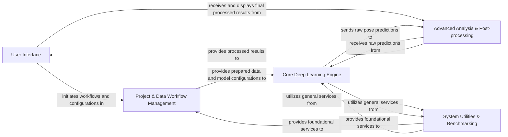

## Details

The DeepLabCut architecture is designed as a modular, pipeline-driven, and data-centric system, emphasizing a clear separation of concerns. The analysis consolidates the project's functionalities into five core components, facilitating maintainability, scalability, and user-friendliness for deep learning-based computer vision tasks.

### User Interface [[Expand]](./User_Interface.md)

The primary interaction layer for users, providing both a comprehensive graphical interface (GUI) and a command-line interface (CLI) to initiate, manage, and monitor all DeepLabCut workflows.

**Related Classes/Methods**:

- <a href="https://github.com/DeepLabCut/DeepLabCut/blob/main/deeplabcut/cli.py#L1-L1" target="_blank" rel="noopener noreferrer">`deeplabcut.cli` (1:1)</a>

- <a href="https://github.com/DeepLabCut/DeepLabCut/blob/main/deeplabcut/__main__.py#L1-L1" target="_blank" rel="noopener noreferrer">`deeplabcut.__main__` (1:1)</a>

- `deeplabcut.gui` (1:1)

### Project & Data Workflow Management [[Expand]](./Project_Data_Workflow_Management.md)

Manages the entire project lifecycle, including creating new DeepLabCut projects, handling video files, extracting frames for labeling, organizing datasets, and managing project-specific configurations. It also integrates model loading and configuration.

**Related Classes/Methods**:

- `deeplabcut.create_project` (1:1)

- `deeplabcut.generate_training_dataset` (1:1)

- `deeplabcut.modelzoo` (1:1)

### Core Deep Learning Engine [[Expand]](./Core_Deep_Learning_Engine.md)

The central computational engine responsible for neural network model definition, training, inference (pose prediction), and internal evaluation, abstracting underlying deep learning frameworks (TensorFlow/PyTorch) via a compatibility layer.

**Related Classes/Methods**:

- <a href="https://github.com/DeepLabCut/DeepLabCut/blob/main/deeplabcut/compat.py#L1-L1" target="_blank" rel="noopener noreferrer">`deeplabcut.compat` (1:1)</a>

- `deeplabcut.pose_estimation_tensorflow` (1:1)

- `deeplabcut.pose_estimation_pytorch` (1:1)

### Advanced Analysis & Post-processing [[Expand]](./Advanced_Analysis_Post_processing.md)

Refines raw pose estimation outputs by applying filtering, correcting outliers, performing 3D pose reconstruction from 2D estimations, and handling multi-animal tracking functionalities. It also prepares data for final display.

**Related Classes/Methods**:

- `deeplabcut.post_processing` (1:1)

- `deeplabcut.refine_training_dataset` (1:1)

- `deeplabcut.pose_estimation_3d` (1:1)

- `deeplabcut.pose_tracking_pytorch` (1:1)

### System Utilities & Benchmarking [[Expand]](./System_Utilities_Benchmarking.md)

A foundational component providing a comprehensive set of reusable helper functions, common data structures, video I/O, file system interactions, configuration parsing, plotting, and tools for quantitatively assessing model performance.

**Related Classes/Methods**:

- `deeplabcut.utils` (1:1)

- `deeplabcut.core` (1:1)

- `deeplabcut.benchmark` (1:1)

### [FAQ](https://github.com/CodeBoarding/GeneratedOnBoardings/tree/main?tab=readme-ov-file#faq)