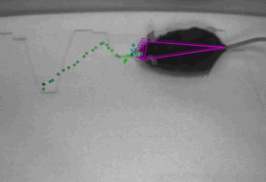
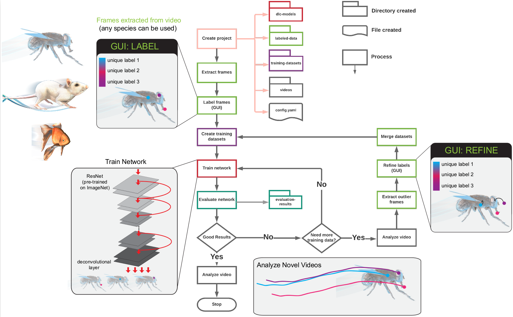
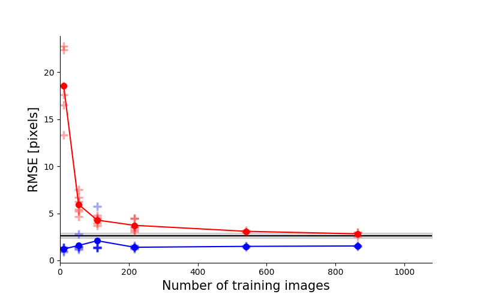
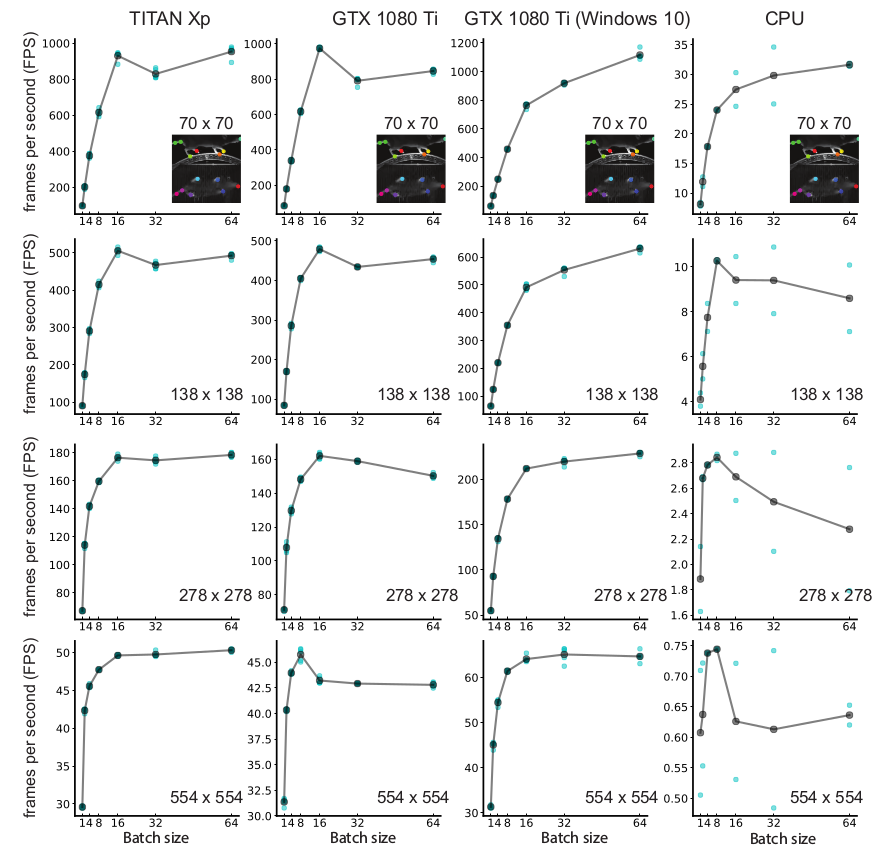
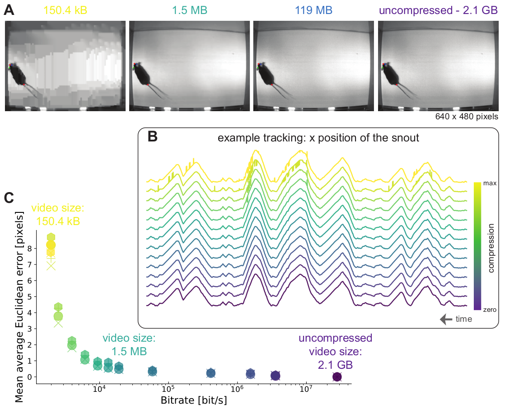

## DeepLabCut 

DeepLabCut is a toolbox for markerless pose estimation of animals performing various tasks, like [trail tracking](https://vnmurthylab.org/), [reaching in mice](http://www.mousemotorlab.org/) and various Drosophila behaviors during egg-laying (see [Mathis et al.](https://www.nature.com/articles/s41593-018-0209-y) for details). There is, however, nothing specific that makes the toolbox only applicable to these tasks and/or species. The toolbox has also already been successfully applied (by us and others) to [rats](http://www.mousemotorlab.org/deeplabcut), humans, various fish species, bacteria, leeches, various robots, cheetahs, [mouse whiskers](http://www.mousemotorlab.org/deeplabcut) and [race horses](http://www.mousemotorlab.org/deeplabcut). 

VERSION 2.0: This is the **python package** of [DeepLabCut](https://www.nature.com/articles/s41593-018-0209-y).
This package includes graphical user interfaces to label your data, and take you from data set creation to automatic behavioral analysis. It also introduces an active learning framework to efficiently use DeepLabCut on large experimental projects. 

VERSION 1.0: The initial, Nature Neuroscience version of **DeepLabCut** can be found in the history of git, or the latest version here: https://github.com/AlexEMG/DeepLabCut/releases/tag/1.11

Please check out [www.mousemotorlab.org/deeplabcut](https://www.mousemotorlab.org/deeplabcut/) for more video demonstrations of automated tracking. Above: courtesy of the Murthy (mouse), Leventhal (rat), and Axel (fly) labs!

# [Installation](docs/installation.md)
# [Overview of the work-flow and how to use DeepLabCut](docs/UseOverviewGuide.md)

# [DEMO the code](/examples) 
We provide several Jupyter Notebooks: one that walks you through a demo dataset to test your installation, and another Notebook to run DeepLabCut from the begining on your own data. We also show you how to use the code in Docker, and on Google Colab.

# News (and in the news):

- Nov 2018: Various (post-hoc) analysis scripts contributed by users (and us) will be gathered at [DLCutils](https://github.com/AlexEMG/DLCutils). Feel free to contribute! In particular, there is a script guiding you through 
importing a project into the new data format for DLC 2.0
- Oct 2018: new pre-print on the speed video-compression and robustness of DeepLabCut on [BioRxiv](https://www.biorxiv.org/content/early/2018/10/30/457242)
- Sept 2018: Nature Lab Animal covers DeepLabCut: [Behavior tracking cuts deep](https://www.nature.com/articles/s41684-018-0164-y)
- Kunlin Wei & Konrad Kording write a very nice News & Views on our paper: [Behavioral Tracking Gets Real](https://www.nature.com/articles/s41593-018-0215-0)
- August 2018: Our [preprint](https://arxiv.org/abs/1804.03142) appeared in [Nature Neuroscience](https://www.nature.com/articles/s41593-018-0209-y)
- August 2018: NVIDIA AI Developer News: [AI Enables Markerless Animal Tracking](https://news.developer.nvidia.com/ai-enables-markerless-animal-tracking/)
- July 2018: Ed Yong covered DeepLabCut and interviewed several users for the [Atlantic](https://www.theatlantic.com/science/archive/2018/07/deeplabcut-tracking-animal-movements/564338). 
- April 2018: first DeepLabCut preprint on [arXiv.org](https://arxiv.org/abs/1804.03142)

# Why using DeepLabCut?

- Due to transfer learning it requires **little training data** for multiple, challenging behaviors (see [Mathis et al.](https://www.nature.com/articles/s41593-018-0209-y) for details). 

- Video anlysis is fast (see [Mathis/Warren](https://www.biorxiv.org/content/early/2018/10/30/457242) for details)

- The feature detectors are robust to video compression (see [Mathis/Warren](https://www.biorxiv.org/content/early/2018/10/30/457242) for details)

- It allows 3D pose estimation with a single network and camera (see [Mathis/Warren](https://www.biorxiv.org/content/early/2018/10/30/457242) for details)

## Code contributors:

[Alexander Mathis](https://github.com/AlexEMG), [Tanmay Nath](http://www.mousemotorlab.org/team), [Mackenzie Mathis](https://github.com/MMathisLab), and especially the authors of DeeperCut authors for the feature detector code. The feature detector code is based on Eldar Insafutdinov's TensorFlow implementation of [DeeperCut](https://github.com/eldar/pose-tensorflow). DeepLabCut is an open-source tool and has benefited from suggestions and edits by many individuals including Richard Warren, Ronny Eichler, Jonas Rauber, Hao Wu, Taiga Abe, and Jonny Saunders. In particular, the authors thank Ronny Eichler for input on the modularized version. We are also grateful to all the beta testers! 

This is an actively developed package and we welcome community development and involvement! If you would like to join the [DeepLabCut Slack group](https://deeplabcut.slack.com), please drop us a note to be invited by emailing: mackenzie@post.harvard.edu

Please check out the following references for more details:

## References:

    @article{Mathisetal2018,
        title={DeepLabCut: markerless pose estimation of user-defined body parts with deep learning},
        author = {Alexander Mathis and Pranav Mamidanna and Kevin M. Cury and Taiga Abe  and Venkatesh N. Murthy and Mackenzie W. Mathis and Matthias Bethge},
        journal={Nature Neuroscience},
        year={2018},
        url={https://www.nature.com/articles/s41593-018-0209-y}
    }
    
    @article{insafutdinov2016eccv,
        title = {DeeperCut: A Deeper, Stronger, and Faster Multi-Person Pose Estimation Model},
        author = {Eldar Insafutdinov and Leonid Pishchulin and Bjoern Andres and Mykhaylo Andriluka and Bernt Schiele},
        booktitle = {ECCV'16},
        url = {http://arxiv.org/abs/1605.03170}
    }
    
Our open source pre-prints:
    
    @article{mathis2018markerless,
        title={Markerless tracking of user-defined features with deep learning},
        author={Mathis, Alexander and Mamidanna, Pranav and Abe, Taiga and Cury, Kevin M and Murthy, Venkatesh N and Mathis, Mackenzie W and Bethge, Matthias},
        journal={arXiv preprint arXiv:1804.03142},
        year={2018}
    }
    
    @article {MathisWarren2018speed,
        author = {Mathis, Alexander and Warren, Richard A.},
        title = {On the inference speed and video-compression robustness of DeepLabCut},
        year = {2018},
        doi = {10.1101/457242},
        publisher = {Cold Spring Harbor Laboratory},
        URL = {https://www.biorxiv.org/content/early/2018/10/30/457242},
        eprint = {https://www.biorxiv.org/content/early/2018/10/30/457242.full.pdf},
        journal = {bioRxiv}
    }

## License:

This project is licensed under the GNU Lesser General Public License v3.0. Note that the software is provided "as is", without warranty of any kind, express or implied. If you use this code, please [cite us!](https://www.nature.com/articles/s41593-018-0209-y).
