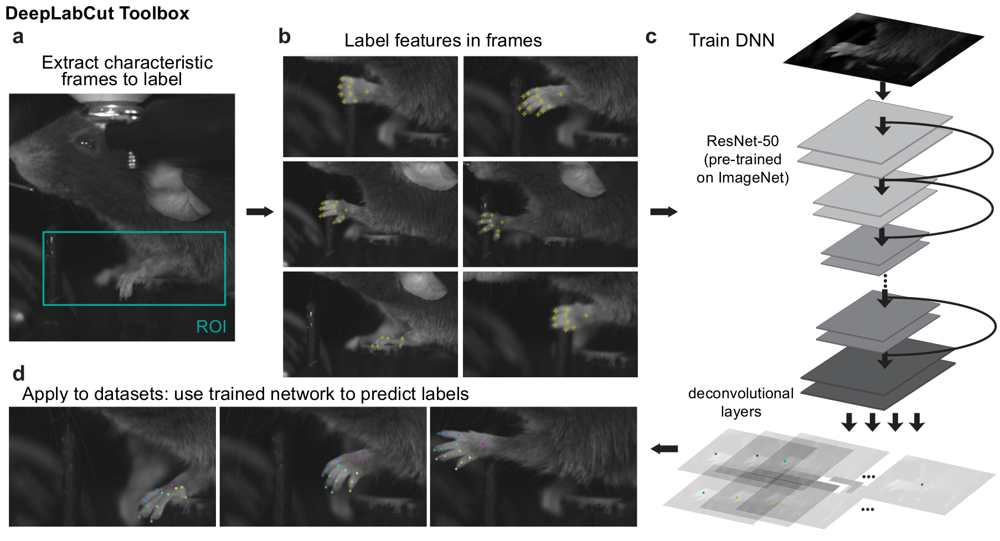

# DeepLabCut

A toolbox for markerless tracking of body parts of animals in lab settings performing various tasks, like [trail tracking](https://vnmurthylab.org/),  [reaching in mice](http://www.mousemotorlab.org/) and various Drosophila behaviors during egg-laying (see [Mathis et al.](https://arxiv.org/abs/1804.03142v1) for details). There is, however, nothing specific that makes the toolbox only applicable to these tasks and/or species. The toolbox has also already been successfully applied to [rats](http://www.mousemotorlab.org/deeplabcut), humans, various fish species, robots, and [race horses](http://www.mousemotorlab.org/deeplabcut).

Please check out [www.mousemotorlab.org/deeplabcut](https://www.mousemotorlab.org/deeplabcut/) for video demonstrations of automated tracking. 

This work utilizes the feature detectors (ResNet + readout layers) of one of the state-of-the-art algorithms for human pose estimation by [Insafutdinov et al.](https://arxiv.org/abs/1605.03170), called DeeperCut, which inspired the name for our toolbox (see references below).

In our preprint we demonstrate that those feature detectors can be trained with few labeled images to achieve excellent tracking accuracy for various body parts in lab tasks. Please check it out:

"[Markerless tracking of user-defined features with deep learning](https://arxiv.org/abs/1804.03142v1)" by Alexander Mathis, Pranav Mamidanna, Taiga Abe, Kevin M. Cury, Venkatesh N. Murthy, Mackenzie W. Mathis* and Matthias Bethge*

## News:

- All the documentation is now organized in a [website format](https://alexemg.github.io/DeepLabCut)!
- We added a simplified installation procedure including a conda environments & a Docker container. See [Installation guide](docs/installation.md)
- Thanks to [Richard Warren](https://github.com/rwarren2163) for checking the compatability of the code in Windows. It works!
- We added **"quick guides"** for training and for the evaluation tools that we provide with the package. We still recommend becoming familiar with the code base via the demo (below) first.
- We also have a Slack group if you have questions that you feel don't fit a github issue ([deeplabcut.slack.com](https://deeplabcut.slack.com)) (please email Mackenzie at mackenzie@post.harvard.edu to join!)

## Overview:

A **typical use case** is: 

A user has **videos of an animal (or animals) performing a behavior** and wants to extract the **position of various body parts** from images/video frames. Ideally these parts are visible to a human annotator, yet potentially difficult to extract by standard image processing methods due to changes in background, body articulation etc. 

To solve this problem, one can train feature detectors in an end-to-end fashion. In order to do so one should:

- label points of interests (e.g. joints, snout, etc.) from distinct frames (containing different poses, individuals etc.)
- train a deep neural network while leaving out labeled frames to check if it generalizes well
- once the network is trained it can be used to analyze videos in a fast way 

The key result of our paper is that one typically requires just a few labeled frames to get excellent tracking results.

The general pipeline for first time use of DeepLabCut is:

**Install --> Extract frames -->  Label training data -->  Train DeeperCut feature detectors -->  Apply your trained network to unlabeled data -->  Extract trajectories for analysis.**

User guide in [website format](https://alexemg.github.io/DeepLabCut).

Once one has a well trained network, one can just use it to analyze heaps of videos (Analysis-tools).

## Installation guide and Hardware and Software Requirements:

[Installation guide](docs/installation.md)

## Demo (and detailed) user instructions for training and testing the network:

[User guide (detailed walk-through with labeled example data)](docs/demo-guide.md)

[Quick guide for training a tailored feature detector network](docs/Quicktraining-guide.md)

[Quick guide for evaluation of feature detectors (on train & test set)](docs/Quickevaluation-guide.md)

## User instructions for analyzing data (with a trained network):

[Analysis guide: How to use trained network to analyze videos?](docs/analysis-tools.md)

## Support:

If you are having issues, please let us know ([Issue Tracker](https://github.com/AlexEMG/DeepLabCut/issues)). Perhaps consider checking the [already closed issues](https://github.com/AlexEMG/DeepLabCut/issues?q=is%3Aissue+is%3Aclosed) and the 
[Frequently asked questions](docs/faq.md) to see if this might help. 

For questions feel free to reach out to: [alexander.mathis@bethgelab.org] or [mackenzie@post.harvard.edu] or join our Slack user group: ([deeplabcut.slack.com](https://deeplabcut.slack.com)) (please email Mackenzie to join!).

## Contribute:

- Issue Tracker: https://github.com/AlexEMG/DeepLabCut/issues
- Source Code: https://github.com/AlexEMG/DeepLabCut
- Project Website: https://alexemg.github.io/DeepLabCut

DeepLabCut is an actively developing project and community contributions are welcome! 

## Code contributors:

[Alexander Mathis](https://github.com/AlexEMG), [Mackenzie Mathis](https://github.com/MMathisLab), and the DeeperCut authors for the feature detector code. Edits and suggestions by [Jonas Rauber](https://github.com/jonasrauber), [Taiga Abe](https://github.com/cellistigs), [Hao Wu](https://github.com/fullerene12), [Jonny Saunders](https://github.com/sneakers-the-rat), [Richard Warren](https://github.com/rwarren2163) and [Brandon Forys](https://github.com/bf777). The feature detector code is based on Eldar Insafutdinov's TensorFlow implementation of [DeeperCut](https://github.com/eldar/pose-tensorflow). Please check out the following references for details:

## References:

    @inproceedings{insafutdinov2017cvpr,
        title = {ArtTrack: Articulated Multi-person Tracking in the Wild},
        booktitle = {CVPR'17},
        url = {http://arxiv.org/abs/1612.01465},
        author = {Eldar Insafutdinov and Mykhaylo Andriluka and Leonid Pishchulin and Siyu Tang and Evgeny Levinkov and Bjoern Andres and Bernt Schiele}
    }
    
    @article{insafutdinov2016eccv,
        title = {DeeperCut: A Deeper, Stronger, and Faster Multi-Person Pose Estimation Model},
        booktitle = {ECCV'16},
        url = {http://arxiv.org/abs/1605.03170},
        author = {Eldar Insafutdinov and Leonid Pishchulin and Bjoern Andres and Mykhaylo Andriluka and Bernt Schiele}
    }
    
    @misc{1804.03142,
    Author = {Alexander Mathis and Pranav Mamidanna and Taiga Abe and Kevin M. Cury and Venkatesh N. Murthy and Mackenzie W. Mathis and Matthias Bethge},
    Title = {Markerless tracking of user-defined features with deep learning},
    Year = {2018},
    Eprint = {arXiv:1804.03142},
    }

## License:

This project is licensed under the GNU Lesser General Public License v3.0.
