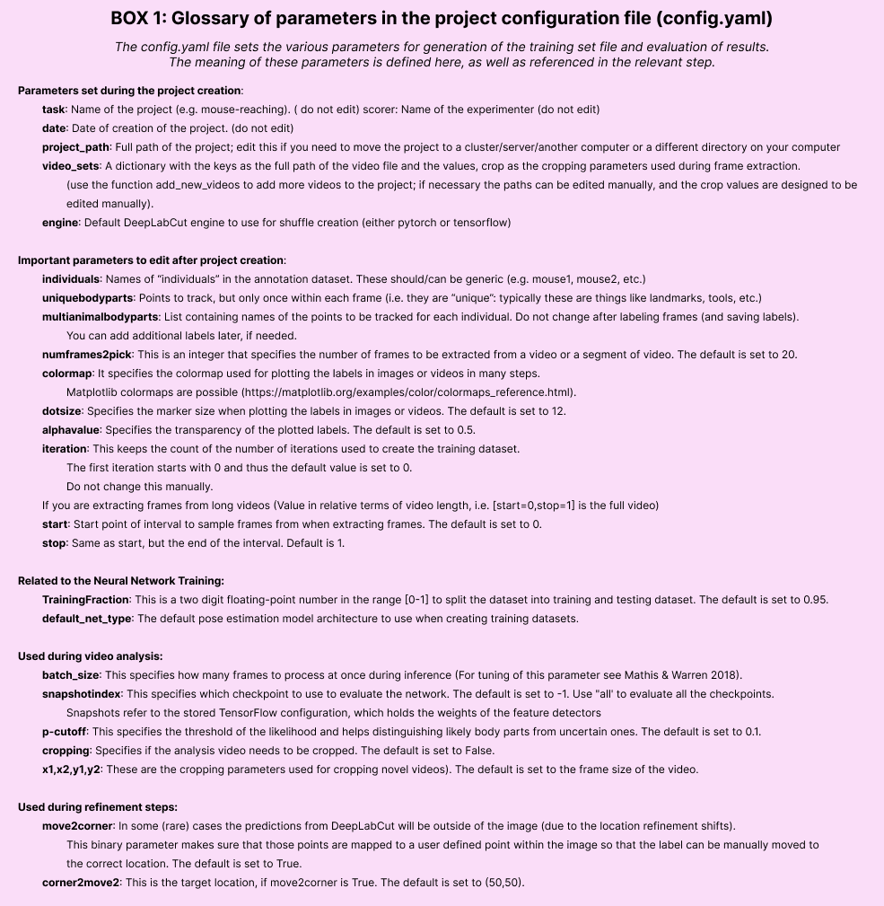

(multi-animal-userguide)=
# DeepLabCut for Multi-Animal Projects

This document should serve as the user guide for maDLC,
and it is here to support the scientific advances presented in [Lauer et al. 2022](https://doi.org/10.1038/s41592-022-01443-0).

Note, we strongly encourage you to use the [Project Manager GUI](project-manager-gui) when you first start using multi-animal mode. Each tab is customized for multi-animal when you create or load a multi-animal project. As long as you follow the recommendations within the GUI, you should be good to go!

````{versionadded} 3.0.0
PyTorch is now available as a deep learning engine for pose estimation models, along 
with new model architectures! For more information about moving from TensorFlow to
PyTorch (if you're already familiar with DeepLabCut & the TensorFlow engine), 
check out [the PyTorch user guide](dlc3-user-guide). If you're just starting 
out with DeepLabCut, we suggest you use the PyTorch backend.
````

## How to think about using maDLC:

You should think of maDLC being **four** parts.
- (1) Curate annotation data that allows you to learn a model to track the objects/animals of interest.
- (2) Create a high-quality pose estimation model.
- (3) Track in space and time, i.e., assemble bodyparts to detected objects/animals and link across time. This step performs assembly and tracking (comprising first local tracking and then tracklet stitching by global reasoning).
- (4) Any and all post-processing you wish to do with the output data, either within DLC or outside of it.

Thus, you should always label, train, and evaluate the pose estimation performance first. If and when that performance is high, then you should go advance to the tracking step (and video analysis). There is a natural break point for this, as you will see below.


## Install:

**Quick start:** If you are using DeepLabCut on the cloud, or otherwise cannot use the GUIs and you should install with: `pip install 'deeplabcut'`; if you need GUI support, please use: `pip install 'deeplabcut[gui]'`. Check the [installation page](how-to-install) for more information, including GPU support.

IF you want to use the bleeding edge version to make edits to the code, see [here on how to install it and test it](https://deeplabcut.github.io/DeepLabCut/docs/recipes/installTips.html#how-to-use-the-latest-updates-directly-from-github).

## Get started in the terminal or Project GUI:

**GUI:** simply launch your conda env, and type `python -m deeplabcut` in the terminal.
Then follow the tabs! It might be useful to read the following, however, so you understand what each command does.

**TERMINAL:** To begin, 🚨 (windows) navigate to anaconda prompt and right-click to "open as admin", or (unix/MacOS) simply launch "terminal" on your computer. We assume you have DeepLabCut installed (if not, [see installation instructions](how-to-install)). Next, launch your conda env (i.e., for example `conda activate DEEPLABCUT`).

```{Hint}
🚨 If you use Windows, please always open the terminal with administrator privileges! Right click, and "run as administrator".
```
 Please read more [here](https://deeplabcut.github.io/DeepLabCut/docs/docker.html), and in our Nature Protocols paper [here](https://www.nature.com/articles/s41596-019-0176-0). And, see our [troubleshooting wiki](https://github.com/DeepLabCut/DeepLabCut/wiki/Troubleshooting-Tips).

Open an ``ipython`` session and import the package by typing in the terminal:
```python
ipython
import deeplabcut
```

```{TIP}
for every function there is a associated help document that can be viewed by adding a **?** after the function name; i.e. ``deeplabcut.create_new_project?``. To exit this help screen, type ``:q``.
```

### (A) Create a New Project

```python
deeplabcut.create_new_project(
    "ProjectName",
    "YourName",
    ["/usr/FullPath/OfVideo1.avi", "/usr/FullPath/OfVideo2.avi", "/usr/FullPath/OfVideo1.avi"],
    copy_videos=True,
    multianimal=True,
)
```

Tip: if you want to place the project folder somewhere specific, please also pass : ``working_directory = "FullPathOftheworkingDirectory"``

- Note, if you are a linux/macOS user the path should look like: ``["/home/username/yourFolder/video1.mp4"]``; if you are a Windows user, it should look like: ``[r"C:\username\yourFolder\video1.mp4"]``
- Note, you can also put ``config_path = `` in front of the above line to create the path to the config.yaml that is used in the next step, i.e. ``config_path=deeplabcut.create_project(...)``)
    - If you do not, we recommend setting a variable so this can be easily used! Once you run this step, the config_path is printed for you once you run this line, so set a variable for ease of use, i.e. something like:
```python
config_path = '/thefulloutputpath/config.yaml'
```
 - just be mindful of the formatting for Windows vs. Unix, see above.

This set of arguments will create a project directory with the name **Name of the project+name of the experimenter+date of creation of the project** in the **Working directory** and creates the symbolic links to videos in the **videos** directory. The project directory will have subdirectories: **dlc-models**, **dlc-models-pytorch**, **labeled-data**, **training-datasets**, and **videos**.  All the outputs generated during the course of a project will be stored in one of these subdirectories, thus allowing each project to be curated in separation from other projects. The purpose of the subdirectories is as follows:

**dlc-models** and **dlc-models-pytorch** have a similar structure: the first contains 
files for the TensorFlow engine while the second contains files for the PyTorch engine.
At the top level in these directories, there are
directories referring to different iterations of labels refinement (see below): **iteration-0**, **iteration-1**, etc.
The refinement iterations directories store shuffle directories, each shuffle directory stores model data related to a
particular experiment: trained and tested on a particular training and testing sets, and with a particular model
architecture. Each shuffle directory contains the subdirectories *test* and *train*, each of which holds the meta
information with regard to the parameters of the feature detectors in configuration files. The configuration files are
YAML files, a common human-readable data serialization language. These files can be opened and edited with standard text
editors. The subdirectory *train* will store checkpoints (called snapshots) during training of the model. These
snapshots allow the user to reload the trained model without re-training it, or to pick-up training from a particular
saved checkpoint, in case the training was interrupted.

**labeled-data:** This directory will store the frames used to create the training dataset. Frames from different videos are stored in separate subdirectories. Each frame has a filename related to the temporal index within the corresponding video, which allows the user to trace every frame back to its origin.

**training-datasets:**  This directory will contain the training dataset used to train the network and metadata, which contains information about how the training dataset was created.

**videos:** Directory of video links or videos. When **copy\_videos** is set to ``False``, this directory contains symbolic links to the videos. If it is set to ``True`` then the videos will be copied to this directory. The default is ``False``. Additionally, if the user wants to add new videos to the project at any stage, the function **add\_new\_videos** can be used. This will update the list of videos in the project's configuration file. Note: you neither need to use this folder for videos, nor is it required for analyzing videos (they can be anywhere).

```python
deeplabcut.add_new_videos(
    "Full path of the project configuration file*",
    ["full path of video 4", "full path of video 5"],
    copy_videos=True/False,
)
```

*Please note, *Full path of the project configuration file* will be referenced as ``config_path`` throughout this protocol.

You can also use annotated data from single-animal projects, by converting those files.
There are docs for this: [convert single to multianimal annotation data](convert-maDLC)



#### API Docs
````{admonition} Click the button to see API Docs
:class: dropdown
```{eval-rst}
.. include:: ./api/deeplabcut.create_new_project.rst
```
````

### (B) Configure the Project

Next, open the **config.yaml** file, which was created during  **create\_new\_project**.
You can edit this file in any text editor. Familiarize yourself with the meaning of the
parameters (Box 1). You can edit various parameters, in particular you **must add the list of *individuals* and *bodyparts* (or points of interest)**.


You can also set the *colormap* here that is used for all downstream steps (can also be edited at anytime), like labeling GUIs, videos, etc. Here any [matplotlib colormaps](https://matplotlib.org/tutorials/colors/colormaps.html) will do!

An easy way to programmatically edit the config file at any time is to use the function **edit\_config**, which takes the full path of the config file to edit and a dictionary of key–value pairs to overwrite.

```python
import deeplabcut

config_path = "/path/to/project-dlc-2025-01-01/config.yaml"
edits = {
    "colormap": "summer",
    "individuals": ["mickey", "minnie", "bianca"],
    "skeleton": [["snout", "tailbase"], ["snout", "rightear"]]
}
deeplabcut.auxiliaryfunctions.edit_config(config_path, edits)
```

Please DO NOT have spaces in the names of bodyparts, uniquebodyparts, individuals, etc.

**ATTENTION:** You need to edit the config.yaml file to **modify the following items** which specify the animal ID, bodyparts, and any unique labels. Note, we also highly recommend that you use **more bodyparts** that you might be interested in for your experiment, i.e., labeling along the spine/tail for 8 bodyparts would be better than four. This will help the performance.

Modifying the `config.yaml` is crucial:

```python
individuals:
- m1
- m2
- m3

uniquebodyparts:
- topleftcornerofBox
- toprightcornerofBox

multianimalbodyparts:
- snout
- leftear
- rightear
- tailbase

identity: True/False
```

**Individuals:** are names of "individuals" in the annotation dataset. These should/can be generic (e.g. mouse1, mouse2, etc.). These individuals are comprised of the same bodyparts defined by `multianimalbodyparts`. For annotation in the GUI and training, it is important that all individuals in each frame are labeled. Thus, keep in mind that you need to set individuals to the maximum number in your labeled-data set, .i.e., if there is (even just one frame) with 17 animals then the list should be `- indv1` to `- indv17`. Note, once trained if you have a video with more or less animals, that is fine - you can have more or less animals during video analysis!

**Identity:** If you can tell the animals apart, i.e.,  one might have a collar, or a black marker on the tail of a mouse, then you should label these individuals consistently (i.e., always label the mouse with the black marker as "indv1", etc). If you have this scenario, please set `identity: True` in your `config.yaml` file. If you have 4 black mice, and you truly cannot tell them apart, then leave this as `false`.

**Multianimalbodyparts:** are the bodyparts of each individual (in the above list).

**Uniquebodyparts:** are points that you want to track, but that appear only once within each frame, i.e. they are "unique". Typically these are things like unique objects, landmarks, tools, etc. They can also be animals, e.g. in the case where one German shepherd is attending to many sheep the sheep bodyparts would be multianimalbodyparts, the shepherd parts would be uniquebodyparts and the individuals would be the list of sheep (e.g. Polly, Molly, Dolly, ...).

### (C) Select Frames to Label

**CRITICAL:** A good training dataset should consist of a sufficient number of frames that capture the breadth of the behavior. This ideally implies to select the frames from different (behavioral) sessions, different lighting and different animals, if those vary substantially (to train an invariant, robust feature detector). Thus for creating a robust network that you can reuse in the laboratory, a good training dataset should reflect the diversity of the behavior with respect to postures, luminance conditions, background conditions, animal identities, etc. of the data that will be analyzed. For the simple lab behaviors comprising mouse reaching, open-field behavior and fly behavior, 100−200 frames gave good results [Mathis et al, 2018](https://www.nature.com/articles/s41593-018-0209-y). However, depending on the required accuracy, the nature of behavior, the video quality (e.g. motion blur, bad lighting) and the context, more or less frames might be necessary to create a good network. Ultimately, in order to scale up the analysis to large collections of videos with perhaps unexpected conditions, one can also refine the data set in an adaptive way (see refinement below). **For maDLC, be sure you have labeled frames with closely interacting animals!**

The function `extract_frames` extracts frames from all the videos in the project configuration file in order to create a training dataset. The extracted frames from all the videos are stored in a separate subdirectory named after the video file’s name under the ‘labeled-data’. This function also has various parameters that might be useful based on the user’s need.

```python
deeplabcut.extract_frames(
    config_path,
    mode='automatic/manual',
    algo='uniform/kmeans',
    userfeedback=False,
    crop=True/False,
)
```

**CRITICAL POINT:** It is advisable to keep the frame size small, as large frames increase the training and
inference time, or you might not have a large enough GPU for this.
When running the function `extract_frames`, if the parameter crop=True, then you will be asked to draw a box within the GUI (and this is written to the config.yaml file).

`userfeedback` allows the user to check which videos they wish to extract frames from. In this way, if you added more videos to the config.yaml file it does not, by default, extract frames (again) from every video. If you wish to disable this question, set `userfeedback = True`.

The provided function either selects frames from the videos in a randomly and temporally uniformly distributed
way (uniform), by clustering based on visual appearance (k-means), or by manual selection. Random
selection of frames works best for behaviors where the postures vary across the whole video. However, some behaviors
might be sparse, as in the case of reaching where the reach and pull are very fast and the mouse is not moving much
between trials (thus, we have the default set to True, as this is best for most use-cases we encounter). In such a case, the function that allows selecting frames based on k-means derived quantization would
be useful. If the user chooses to use k-means as a method to cluster the frames, then this function downsamples the
video and clusters the frames using k-means, where each frame is treated as a vector. Frames from different clusters
are then selected. This procedure makes sure that the frames look different. However, on large and long videos, this
code is slow due to computational complexity.

**CRITICAL POINT:** It is advisable to extract frames from a period of the video that contains interesting
behaviors, and not extract the frames across the whole video. This can be achieved by using the start and stop
parameters in the config.yaml file. Also, the user can change the number of frames to extract from each video using
the numframes2extract in the config.yaml file.

```{TIP}
For maDLC,  **be sure you have labeled frames with closely interacting animals**! 
Therefore, manually selecting some frames is a good idea if interactions are not highly
frequent in the video.
```

However, picking frames is highly dependent on the data and the behavior being studied.
Therefore, it is hard to provide all purpose code that extracts frames to create a good
training dataset for every behavior and animal. If the user feels specific frames are
lacking, they can extract hand selected frames of interest using the interactive GUI
provided along with the toolbox. This can be launched by using:

```python
deeplabcut.extract_frames(config_path, 'manual')
```

// FIXME(niels) - add a napari frame extractor description.
The user can use the *Load Video* button to load one of the videos in the project
configuration file, use the scroll bar to navigate across the video and *Grab a Frame*. 
The user can also look at the extracted frames and e.g. delete frames (from the
directory) that are too similar before reloading the set and then manually annotating
them.

````{admonition} Click the button to see API Docs
:class: dropdown
```{eval-rst}
.. include:: ./api/deeplabcut.extract_frames.rst
```
````

### (D) Label Frames

```python
deeplabcut.label_frames(config_path)
```

The toolbox provides a function **label_frames** which helps the user to easily label
all the extracted frames using an interactive graphical user interface (GUI). The user
should have already named the bodyparts to label (points of interest) in the 
project’s configuration file by providing a list. The following command invokes the 
napari-deeplabcut labelling GUI.

[🎥 DEMO](https://youtu.be/hsA9IB5r73E)

HOT KEYS IN THE Labeling GUI (also see "help" in GUI):

```
Ctrl + C: Copy labels from previous frame.
Keyboard arrows: advance frames.
Delete key: delete label.
```


**CRITICAL POINT:** It is advisable to **consistently label similar spots** (e.g., on a
wrist that is very large, try to label the same location). In general, invisible or
occluded points should not be labeled by the user, unless you want to teach the network
to "guess" - this is possible, but could affect accuracy. If you don't want/or don't see
a bodypart, they can simply be skipped by not applying the label anywhere on the frame.

OPTIONAL: In the event of adding more labels to the existing labeled dataset, the user 
needs to append the new labels to the bodyparts in the config.yaml file. Thereafter, the
user can call the function **label_frames**. A box will pop up and ask the user if they
wish to display all parts, or only add in the new labels. Saving the labels after all
the images are labelled will append the new labels to the existing labeled dataset.

**maDeepLabCut CRITICAL POINT:** For multi-animal labeling, unless you can tell apart
the animals, you do not need to worry about the "ID" of each animal. For example: if you
have a white and black mouse label the white mouse as animal 1, and black as animal 2
across all frames. If two black mice, then the ID label 1 or 2 can switch between 
frames - no need for you to try to identify them (but always label consistently within a
frame). If you have 2 black mice but one always has an optical fiber (for example), then
DO label them consistently as animal1 and animal_fiber (for example). The point of 
multi-animal DLC is to train models that can first group the correct bodyparts to
individuals, then associate those points in a given video to a specific individual,
which then also uses temporal information to link across the video frames.

Note, we also highly recommend that you use more bodyparts that you might otherwise have
(see the example below).

For more information, checkout the [napari-deeplabcut docs](napari-gui) for 
more information about the labelling workflow.

### (E) Check Annotated Frames

Checking if the labels were created and stored correctly is beneficial for training, since labeling
is one of the most critical parts for creating the training dataset. The DeepLabCut toolbox provides a function
`check_labels` to do so. It is used as follows:

```python
deeplabcut.check_labels(config_path, visualizeindividuals=True/False)
 ```

**maDeepLabCut:** you can check and plot colors per individual or per body part, just set the flag `visualizeindividuals=True/False`. Note, you can run this twice in both states to see both images.

<p align="center">

</p>

For each video directory in labeled-data this function creates a subdirectory with **labeled** as a suffix. Those directories contain the frames plotted with the annotated body parts. The user can double check if the body parts are labeled correctly. If they are not correct, the user can reload the frames (i.e. `deeplabcut.label_frames`), move them around, and click save again.

````{admonition} Click the button to see API Docs
:class: dropdown
```{eval-rst}
.. include:: ./api/deeplabcut.check_labels.rst
```
````

### (F) Create Training Dataset

At this point, you'll need to select your neural network type.

For the **PyTorch engine**, please see [the PyTorch Model Architectures](
dlc3-architectures) for options.

For the **TensorFlow engine**, please see Lauer et al. 2021 for options. Multi-animal
models will use `imgaug`, ADAM optimization, our new DLCRNet, and batch training. We
suggest keeping these defaults at this time. At this step, the ImageNet pre-trained
networks (i.e. ResNet-50) weights will be downloaded. If they do not download (you will
see this downloading in the terminal, then you may not have permission to do so (
something we have seen with some Windows users - see the **[
WIKI troubleshooting for more help!](
https://github.com/DeepLabCut/DeepLabCut/wiki/Troubleshooting-Tips)**).

Then run:

```python
deeplabcut.create_training_dataset(config_path)
```

- The set of arguments in the function will shuffle the combined labeled dataset and split it to create train and test
sets. The subdirectory with suffix ``iteration#`` under the directory **training-datasets** stores the dataset and meta
information, where the ``#`` is the value of ``iteration`` variable stored in the project’s configuration file (this number
keeps track of how often the dataset was refined).

- OPTIONAL: If the user wishes to benchmark the performance of the DeepLabCut, they can create multiple
training datasets by specifying an integer value to the `num_shuffles`; see the docstring for more details.

- Each iteration of the creation of a training dataset will create several files, which
is used by the feature detectors, and a ``.pickle`` file that contains the meta
information about the training dataset. This also creates two subdirectories within
**dlc-models-pytorch** (**dlc-models** for the TensorFlow engine) called ``test`` and
``train``, and these each have a configuration file called pose_cfg.yaml. Specifically,
the user can edit the **pytorch_config.yaml** (**pose_cfg.yaml** for TensorFlow engine)
within the **train** subdirectory before starting the training. These configuration
files contain meta information with regard to the parameters of the feature detectors.
Key parameters are listed in Box 2.

**DATA AUGMENTATION:** At this stage you can also decide what type of augmentation to
use. Once you've called `create_training_dataset`, you can edit the 
[**pytorch_config.yaml**](dlc3-pytorch-config) file that was created (or for the
TensorFlow engine, the [**pose_cfg.yaml**](
https://github.com/DeepLabCut/DeepLabCut/blob/master/deeplabcut/pose_cfg.yaml) file).

- PyTorch Engine: [Albumentations](https://albumentations.ai/docs/) is used for data
augmentation. Look at the [**pytorch_config.yaml**](dlc3-pytorch-config) for more 
information about image augmentation options.
- TensorFlow Engine: The default augmentation works well for most tasks (as shown on
www.deeplabcut.org), but there are many options, more data augmentation, intermediate
supervision, etc. Only `imgaug` augmentation is available for multi-animal projects.

[A Primer on Motion Capture with Deep Learning: Principles, Pitfalls, and Perspectives](
https://www.cell.com/neuron/pdf/S0896-6273(20)30717-0.pdf), details the advantage of
augmentation for a worked example (see Fig 8). TL;DR: use imgaug and use the symmetries
of your data!

Importantly, image cropping as previously done with `deeplabcut.cropimagesandlabels` in multi-animal projects
is now part of the augmentation pipeline. In other words, image crops are no longer stored in labeled-data/..._cropped
folders. Crop size still defaults to (400, 400); if your images are very large (e.g. 2k, 4k pixels), consider increasing the crop size, but be aware unless you have a strong GPU (24 GB memory or more), you will hit memory errors. You can lower the batch size, but this may affect performance.

In addition, one can specify a crop sampling strategy: crop centers can either be taken at random over the image (`uniform`) or the annotated keypoints (`keypoints`); with a focus on regions of the scene with high body part density (`density`); last, combining `uniform` and `density` for a `hybrid` balanced strategy (this is the default strategy). Note that both parameters can be easily edited prior to training in the **pose_cfg.yaml** configuration file.
As a reminder, cropping images into smaller patches is a form of data augmentation that simultaneously
allows the use of batch processing even on small GPUs that could not otherwise accommodate larger images + larger batchsizes (this usually increases performance and decreasing training time).

**MODEL COMPARISON**: You can also test several models by creating the same train/test
split for different networks.
You can easily do this in the Project Manager GUI (by selecting the "Use an existing 
data split" option), which also lets you compare PyTorch and TensorFlow models.

````{versionadded} 3.0.0
You can now create new shuffles using the same train/test split as 
existing shuffles with `create_training_dataset_from_existing_split`. This allows you to
compare model performance (between different architectures or when using different
training hyper-parameters) as the shuffles were trained on the same data, and evaluated
on the same test data!

Example usage - creating 3 new shuffles (with indices 10, 11 and 12) for a ResNet 50
pose estimation model, using the same data split as was used for shuffle 0:

```python
deeplabcut.create_training_dataset_from_existing_split(
    config_path,
    from_shuffle=0,
    shuffles=[10, 11, 12],
    net_type="resnet_50",
)
```
````

````{admonition} Click the button to see API Docs for deeplabcut.create_training_dataset
:class: dropdown
```{eval-rst}
.. include:: ./api/deeplabcut.create_training_dataset.rst
```
````

````{admonition} Click the button to see API Docs for deeplabcut.create_training_model_comparison
:class: dropdown
```{eval-rst}
.. include:: ./api/deeplabcut.create_training_model_comparison.rst
```
````

````{admonition} Click the button to see API Docs for deeplabcut.create_training_dataset_from_existing_split
:class: dropdown
```{eval-rst}
.. include:: ./api/deeplabcut.create_training_dataset_from_existing_split.rst
```
````

### (G) Train The Network

```python
deeplabcut.train_network(config_path, shuffle=1)
```

The set of arguments in the function starts training the network for the dataset created
for one specific shuffle. Note that you can change training parameters in the 
[**pytorch_config.yaml**](dlc3-pytorch-config) file (or **pose_cfg.yaml** for TensorFlow
models) of the model that you want to train (before you start training).

At user specified iterations during training checkpoints are stored in the subdirectory 
*train* under the respective iteration & shuffle directory.

````{admonition} Tips on training models with the PyTorch Engine
:class: dropdown

Example parameters that one can call:

```python
deeplabcut.train_network(
    config_path,
    shuffle=1,
    trainingsetindex=0,
    device="cuda:0",
    max_snapshots_to_keep=5,
    displayiters=100,
    save_epochs=5,
    epochs=200,
)
```

Pytorch models in DeepLabCut 3.0 are trained for a set number of epochs, instead of a
maximum number of iterations (which is what was used for TensorFlow models). An epoch
is a single pass through the training dataset, which means your model has seen each
training image exactly once. So if you have 64 training images for your network, an
epoch is 64 iterations with batch size 1 (or 32 iterations with batch size 2, 16 with
batch size 4, etc.).

By default, the pretrained networks are not in the DeepLabCut toolbox (as they can be 
more than 100MB), but they get downloaded automatically before you train.

If the user wishes to restart the training at a specific checkpoint they can specify the
full path of the checkpoint to the variable ``resume_training_from`` in the [
**pytorch_config.yaml**](
dlc3-pytorch-config) file (checkout the "Restarting Training at a Specific Checkpoint"
section of the docs) under the *train* subdirectory.

**CRITICAL POINT:** It is recommended to train the networks **until the loss plateaus** 
(depending on the dataset, model architecture and training hyper-parameters this happens
after 100 to 250 epochs of training).

The variables ``display_iters`` and ``save_epochs`` in the [**pytorch_config.yaml**](
dlc3-pytorch-config) file allows the user to alter how often the loss is displayed
and how often the weights are stored. We suggest saving every 5 to 25 epochs.
````

````{admonition} Tips on training models with the TensorFlow Engine 
:class: dropdown

Example parameters that one can call:

```python
deeplabcut.train_network(
    config_path,
    shuffle=1,
    trainingsetindex=0,
    gputouse=None,
    max_snapshots_to_keep=5,
    autotune=False,
    displayiters=100,
    saveiters=15000,
    maxiters=30000,
    allow_growth=True,
)
```

By default, the pretrained networks are not in the DeepLabCut toolbox (as they are 
around 100MB each), but they get downloaded before you train. However, if not previously
downloaded from the TensorFlow model weights, it will be downloaded and stored in a
subdirectory *pre-trained* under the subdirectory *models* in 
*Pose_Estimation_Tensorflow*. At user specified iterations during training checkpoints
are stored in the subdirectory *train* under the respective iteration directory.

If the user wishes to restart the training at a specific checkpoint they can specify the
full path of the checkpoint to the variable ``init_weights`` in the **pose_cfg.yaml**
file under the *train* subdirectory (see Box 2).

**CRITICAL POINT:** It is recommended to train the networks for thousands of iterations
until the loss plateaus (typically around **500,000**) if you use batch size 1, and
**50-100K** if you use batchsize 8 (the default).

If you use **maDeepLabCut** the recommended training iterations is **20K-100K** 
(it automatically stops at 200K!), as we use Adam and batchsize 8; if you have to reduce
 the batchsize for memory reasons then the number of iterations needs to be increased.

The variables ``display_iters`` and ``save_iters`` in the **pose_cfg.yaml** file allows
the user to alter how often the loss is displayed and how often the weights are stored.

**maDeepLabCut CRITICAL POINT:** For multi-animal projects we are using not only
different and new output layers, but also new data augmentation, optimization, learning
rates, and batch training defaults. Thus, please use a lower ``save_iters`` and
``maxiters``. I.e. we suggest saving every 10K-15K iterations, and only training until
50K-100K iterations. We recommend you look closely at the loss to not overfit on your
data. The bonus, training time is much less!!!
````

````{admonition} Click the button to see API Docs for train_network
:class: dropdown
```{eval-rst}
.. include:: ./api/deeplabcut.train_network.rst
```
````

### (H) Evaluate the Trained Network

It is important to evaluate the performance of the trained network. This performance is 
measured by computing two metrics:

- **Average root mean square error** (RMSE) between the manual labels and the ones
predicted by your trained DeepLabCut model. The RMSE is proportional to the mean average
Euclidean error (MAE) between the manual labels and the ones predicted by DeepLabCut. 
The MAE is displayed for all pairs and only likely pairs (>p-cutoff). This helps to
exclude, for example, occluded body parts. One of the strengths of DeepLabCut is that
due to the probabilistic output of the scoremap, it can, if sufficiently trained, also 
reliably report if a body part is visible in a given frame. (see discussions of finger
tips in reaching and the Drosophila legs during 3D behavior in [Mathis et al, 2018]).
- **Mean Average Precision** (mAP) and **Mean Average Recall** (mAR) for the individuals
predicted by your trained DeepLabCut model. This metric describes the precision of your
model, based on a considered definition of what a correct detection of an individual is.
It isn't as useful for single-animal models, as RMSE does a great job of evaluating your
model in that case.

```{admonition} A more detailed description of mAP and mAR
:class: dropdown

For multi-animal pose estimation, multiple predictions can be made for each image.
We want to get some idea of the proportion of correct predictions among all predictions
that are made.
However, the notion of "correct prediction" for pose estimation is not straightforward:
is a prediction correct if all predicted keypoints are within 5 pixels of the ground
truth? Within 2 pixels of the ground truth? What if all pixels but one match the ground
truth perfectly, but the wrong prediction is 50 pixels away? Mean average precision (
and mean average recall) estimate the precision/recall of your models by setting 
different "thresholds of correctness" and averaging results. How "correct" a
prediction is can be evaluated through [object-keypoint similarity](
https://cocodataset.org/#keypoints-eval).

A good resource to get a deeper understanding of mAP is the [Stanford CS230 course](
https://cs230.stanford.edu/section/8/#object-detection-iou-ap-and-map). While it 
describes mAP for object detection (where bounding boxes are predicted instead of 
keypoints), the same metric can be computed for pose estimation, where similarity 
between predictions and ground truth is computed through [object-keypoint similarity](
https://cocodataset.org/#keypoints-eval) instead of intersection-over-union (IoU). 
```

It's also important to visually inspect predictions on individual frames to assess the
performance of your model. You can do this by setting `plotting=True` when you call
`evaluate_network`. The evaluation results are computed by typing:

```python
deeplabcut.evaluate_network(config_path, Shuffles=[1], plotting=True)
```

🎥 [VIDEO TUTORIAL AVAILABLE!](https://www.youtube.com/watch?v=bgfnz1wtlpo)

Setting ``plotting`` to True plots all the testing and training frames with the manual and predicted labels; these will
be colored by body part type by default. They can alternatively be colored by individual by passing `plotting="individual"`.
The user should visually check the labeled test (and training) images that are created in the ‘evaluation-results’ directory.
Ideally, DeepLabCut labeled unseen (test images) according to the user’s required accuracy, and the average train
and test errors are comparable (good generalization). What (numerically) comprises an acceptable MAE depends on
many factors (including the size of the tracked body parts, the labeling variability, etc.). Note that the test error can
also be larger than the training error due to human variability (in labeling, see Figure 2 in Mathis et al, Nature Neuroscience 2018).

**Optional parameters:**

- `Shuffles: list, optional` - List of integers specifying the shuffle indices of the training dataset.
The default is [1]

- `plotting: bool | str, optional` - Plots the predictions on the train and test images. The default is `False`;
if provided it must be either `True`, `False`, `"bodypart"`, or `"individual"`.

- `show_errors: bool, optional` - Display train and test errors. The default is `True`

- `comparisonbodyparts: list of bodyparts, Default is all` - The average error will be computed for those body parts
only (Has to be a subset of the body parts).

- `gputouse: int, optional` - Natural number indicating the number of your GPU (see number in nvidia-smi). If you do not
have a GPU, put None. See: https://nvidia.custhelp.com/app/answers/detail/a_id/3751/~/useful-nvidia-smi-queries

- `pcutoff: float | list[float] | dict[str, float], optional`
(Only applicable when using the PyTorch engine. For TensorFlow, set `pcutoff` in the `config.yaml` file.)
Specifies the cutoff value(s) used to compute evaluation metrics.
  - If `None` (default), the cutoff will be loaded from the project configuration.
  - To apply a single cutoff value to all bodyparts, provide a `float`.
  - To specify different cutoffs per bodypart, provide either:
    - A `list[float]`: one value per bodypart, with an additional value for each unique bodypart if applicable.
    - A `dict[str, float]`: where keys are bodypart names and values are the corresponding cutoff values.
If a bodypart is not included in the provided dictionary, a default `pcutoff` of `0.6` will be used for that bodypart.

The plots can be customized by editing the **config.yaml** file (i.e., the colormap, scale, marker size (dotsize), and
transparency of labels (alpha-value) can be modified). By default each body part is plotted in a different color
(governed by the colormap) and the plot labels indicate their source. Note that by default the human labels are
plotted as plus (‘+’), DeepLabCut’s predictions either as ‘.’ (for confident predictions with likelihood > `pcutoff`) and
’x’ for (likelihood <= `pcutoff`).

The evaluation results for each shuffle of the training dataset are stored in a unique
subdirectory in a newly created directory ‘evaluation-results-pytorch’ (or 
‘evaluation-results’ for TensorFlow models) in the project directory.
The user can visually inspect if the distance between the labeled and the predicted body
parts are acceptable. In the event of benchmarking with different shuffles of same training
dataset, the user can provide multiple shuffle indices to evaluate the corresponding 
network. If the generalization is not sufficient, the user might want to:

• check if the labels were imported correctly; i.e., invisible points are not labeled
and the points of interest are labeled accurately

• make sure that the loss has already converged

• consider labeling additional images and make another iteration of the training data set

````{admonition} Click the button to see API Docs for evaluate_network
:class: dropdown
```{eval-rst}
.. include:: ./api/deeplabcut.evaluate_network.rst
```
````

**maDeepLabCut: (or on normal projects!)**

In multi-animal projects, model evaluation is crucial as this is when
the data-driven selection of the optimal skeleton is carried out. Skipping that step
causes video analysis to use the redundant skeleton by default, which is not only slow
but does not guarantee best performance.

You should also plot the scoremaps, locref layers, and PAFs to assess performance:

```python
deeplabcut.extract_save_all_maps(config_path, shuffle=shuffle, Indices=[0, 5])
```

You can drop "Indices" to run this on all training/testing images (this is very slow!)

### (I) Analyze new Videos

````{versionadded} 3.0.0
With the addition of conditional top-down models in DeepLabCut 3.0, it's now possible to
track individuals directly **during video analysis**. If you choose to train any model
with a name that starts with `ctd_`, you'll be able to call `deeplabcut.analyze_videos`
with `ctd_tracking=True`. To learn more about tracking with CTD, see the [
`COLAB_BUCTD_and_CTD_tracking`](
https://github.com/DeepLabCut/DeepLabCut/blob/main/examples/COLAB/COLAB_BUCTD_and_CTD_tracking.ipynb)
COLAB notebook.
````

**-------------------- DECISION POINT -------------------**

**ATTENTION!**
**Pose estimation and tracking should be thought of as separate steps.** If you do not 
have good pose estimation evaluation metrics at this point, stop, check original labels,
add more data, etc --> don't move forward with this model. If you think you have a good
model, please test the "raw" pose estimation performance on a video to validate
performance:

Please run:

```python
videos_to_analyze = ['/fullpath/project/videos/testVideo.mp4']
scorername = deeplabcut.analyze_videos(config_path, videos_to_analyze, videotype='.mp4')
deeplabcut.create_video_with_all_detections(config_path, videos_to_analyze, videotype='.mp4')
```

Please note that you do **not** get the .h5/csv file you might be used to getting (this
comes after tracking). You will get a `pickle` file that is used in
`create_video_with_all_detections`.

For models predicting part-affinity fields, another sanity check may be to 
examine the distributions of edge affinity costs using `deeplabcut.utils.plot_edge_affinity_distributions`. Easily separable distributions
indicate that the model has learned strong links to group keypoints into distinct
individuals — likely a necessary feature for the assembly stage (note that the amount of
overlap will also depend on the amount of interactions between your animals in the
dataset). All TensorFlow multi-animal models use part-affinity fields and PyTorch models
consisting of just a backbone name (e.g. `resnet_50`, `resnet_101`) use part-affinity
fields. If you're unsure whether your PyTorch model has a one, check 
the **pytorch_config.yaml** for a `DLCRNetHead`.

IF you have good clean out video, ending in `....full.mp4` (and the evaluation metrics
look good, scoremaps look good, plotted evaluation images, and affinity distributions
are far apart for most edges), then go forward!!!

If this does not look good, we recommend extracting and labeling more frames (even from more videos). Try to label close interactions of animals for best performance. Once you label more, you can create a new training set and train.

You can either:
1. extract more frames manually from existing or new videos and label as when initially building the training data set, or
2. let DeepLabCut find frames where keypoints were poorly detected and automatically extract those for you. All you need is
to run:

```python
deeplabcut.find_outliers_in_raw_data(config_path, pickle_file, video_file)
```

where pickle_file is the `_full.pickle` one obtains after video analysis.
Flagged frames will be added to your collection of images in the corresponding labeled-data folders for you to label.


### Animal Assembly and Tracking across frames

After pose estimation, now you perform assembly and tracking.

````{versionadded} v2.2.0
*NEW* in 2.2 is a novel data-driven way to set the optimal skeleton and assembly
metrics, so this no longer requires user input. The metrics, in case you do want to edit
them, can be found in the `inference_cfg.yaml` file.
````

### Optimized Animal Assembly + Video Analysis:
Please note that **novel videos DO NOT need to be added to the config.yaml file**. You
can simply have a folder elsewhere on your computer and pass the video folder (then it
will analyze all videos of the specified type (i.e. ``videotype='.mp4'``), or pass the
path to the **folder** or exact video(s) you wish to analyze:

```python
deeplabcut.analyze_videos(config_path, ['/fullpath/project/videos/'], videotype='.mp4', auto_track=True)
```

#### IF auto_track = True:

```{versionadded} v2.2.0.3
A new argument `auto_track=True`, was added to `deeplabcut.analyze_videos` chaining pose
estimation, tracking, and stitching in a single function call with defaults we found to
work well. Thus, you'll now get the `.h5` file you might be used to getting in standard
DLC. If `auto_track=False`, one must run `convert_detections2tracklets` and
`stitch_tracklets` manually (see below), granting more control over the last steps of
the workflow (ideal for advanced users).
```

#### IF auto_track = False:

You can validate the tracking parameters. Namely, you can iteratively change the
parameters, run `convert_detections2tracklets` then load them in the GUI 
(`refine_tracklets`) if you want to look at the performance. If you want to edit these,
you will need to open the `inference_cfg.yaml` file (or click button in GUI). The
options are:

```python
# Tracking:
#p/m pixels in width and height for increasing bounding boxes.
boundingboxslack : 0
# Intersection over Union (IoU) threshold for linking two bounding boxes
iou_threshold: .2
# maximum duration of a lost tracklet before it's considered a "new animal" (in frames)
max_age: 100
# minimum number of consecutive frames before a detection is tracked
min_hits: 3
```

  - **IMPORTANT POINT FOR SUPERVISED IDENTITY TRACKING**

    If the network has been trained to learn the animals' identities (i.e., you set `identity=True` in config.yaml before training) this information can be leveraged both during: (i) animal assembly, where body parts are grouped based on the animal they are predicted to belong to (affinity between pairs of keypoints is no longer considered in that case); and (ii) animal tracking, where identity only can be utilized in place of motion trackers to form tracklets.

To use this ID information, simply pass:
```python
deeplabcut.convert_detections2tracklets(..., identity_only=True)
```

- **Note:** If only one individual is to be assembled and tracked, assembly and tracking are skipped, and detections are treated as in single-animal projects; i.e., it is the keypoints with highest confidence that are kept and accumulated over frames to form a single, long tracklet. No action is required from users, this is done automatically.


**Animal assembly and tracking quality** can be assessed via `deeplabcut.utils.make_labeled_video.create_video_from_pickled_tracks`. This function provides an additional diagnostic tool before moving on to refining tracklets.


If animal assemblies do not look pretty, an alternative to the outlier search described above is to pass the
`_assemblies.pickle` to `find_outliers_in_raw_data` in place of the `_full.pickle`.
This will focus the outlier search on unusual assemblies (i.e., animal skeletons that were oddly reconstructed). This may be a bit more sensitive with crowded scenes or frames where animals interact closely.
Note though that at that stage it is likely preferable anyway to carry on with the remaining steps, and extract outliers
from the final h5 file as was customary in single animal projects.


**Next, tracklets are stitched to form complete tracks with:

```python
deeplabcut.stitch_tracklets(
    config_path,
    ['videofile_path'],
    videotype='mp4',
    shuffle=1,
    trainingsetindex=0,
)
```

Note that the base signature of the function is identical to `analyze_videos` and `convert_detections2tracklets`.
If the number of tracks to reconstruct is different from the number of individuals
originally defined in the config.yaml, `n_tracks` (i.e., the number of animals you have in your video)
can be directly specified as follows:

```python
deeplabcut.stitch_tracklets(..., n_tracks=n)
```

In such cases, file columns will default to dummy animal names (ind1, ind2, ..., up to indn).

#### API Docs

````{admonition} Click the button to see API Docs for analyze_videos
:class: dropdown
```{eval-rst}
.. include:: ./api/deeplabcut.analyze_videos.rst
```
````

````{admonition} Click the button to see API Docs for convert_detections2tracklets
:class: dropdown
```{eval-rst}
.. include:: ./api/deeplabcut.convert_detections2tracklets.rst
```
````

````{admonition} Click the button to see API Docs for stitch_tracklets
:class: dropdown
```{eval-rst}
.. include:: ./api/deeplabcut.stitch_tracklets.rst
```
````

### Using Unsupervised Identity Tracking:

In Lauer et al. 2022 we introduced a new method to do unsupervised reID of animals.
Here, you can use the tracklets to learn the identity of animals to enhance your
tracking performance. To use the code:

```python
deeplabcut.transformer_reID(config, videos_to_analyze, n_tracks=None, videotype="mp4")
```

Note you should pass the n_tracks (number of animals) you expect to see in the video.

### Refine Tracklets:

You can also optionally **refine the tracklets**. You can fix both "major" ID swaps, i.e. perhaps when animals cross, and you can micro-refine the individual body points. You will load the `...trackertype.pickle` or `.h5'` file that was created above, and then you can launch a GUI to interactively refine the data. This also has several options, so please check out the docstring. Upon saving the refined tracks you get an `.h5` file (akin to what you might be used to from standard DLC. You can also load (1) filter this to take care of small jitters, and (2) load this `.h5` this to refine (again) in case you find another issue, etc!

```python
deeplabcut.refine_tracklets(config_path, pickle_or_h5_file, videofile_path, max_gap=0, min_swap_len=2, min_tracklet_len=2, trail_len=50)
```

If you use the GUI (or otherwise), here are some settings to consider:


*note, setting `max_gap=0` can be used to fill in all frames across the video; otherwise, 1-n is the # of frames you want to fill in, i.e. maybe you want to fill in short gaps of 5 frames, but 15 frames indicates another issue, etc. You can test this in the GUI very easy by editing the value and then re-launch pop-up GUI.

If you fill in gaps, they will be associated to an ultra low probability, 0.01, so you are aware this is not the networks best estimate, this is the human-override! Thus, if you create a video, you need to set your pcutoff to 0 if you want to see these filled in frames.

[Read more here!](functionDetails.md#madeeplabcut-critical-point---assemble--refine-tracklets)

Short demo:
 <p align="center">

</p>

### (J) Filter Pose Data

Firstly, Here are some tips for scaling up your video analysis, including looping over many folders for batch processing: https://github.com/DeepLabCut/DeepLabCut/wiki/Batch-Processing-your-Analysis

You can also filter the predicted bodyparts by:
```python
deeplabcut.filterpredictions(config_path,['/fullpath/project/videos/reachingvideo1.avi'])
```
Note, this creates a file with the ending filtered.h5 that you can use for further analysis. This filtering step has many parameters, so please see the full docstring by typing: ``deeplabcut.filterpredictions?``

````{admonition} Click the button to see API Docs
:class: dropdown
```{eval-rst}
.. include:: ./api/deeplabcut.filterpredictions.rst
```
````

### (K) Plot Trajectories , (L) Create Labeled Videos

- **NOTE :bulb::mega::** Before you create a video, you should set what threshold to use for plotting. This is set in the `config.yaml` file as `pcutoff` - if you have a well trained network, this should be high, i.e. set it to `0.8` or higher! IF YOU FILLED IN GAPS, you need to set this to `0` to "see" the filled in parts.


- You can also determine a good `pcutoff` value by looking at the likelihood plot created during `plot_trajectories`:

Plot the outputs:
```python
  deeplabcut.plot_trajectories(config_path,['/fullpath/project/videos/reachingvideo1.avi'],filtered = True)
```

Create videos:
```python
  deeplabcut.create_labeled_video(config_path, [videos], videotype='avi', shuffle=1, trainingsetindex=0, filtered=False, fastmode=True, save_frames=False, keypoints_only=False, Frames2plot=None, displayedbodyparts='all', displayedindividuals='all', codec='mp4v', outputframerate=None, destfolder=None, draw_skeleton=False, trailpoints=0, displaycropped=False, color_by='bodypart', track_method='')
```
- **NOTE :bulb::mega::** You have a lot of options in terms of video plotting (quality, display type, etc). We recommend checking the docstring!

(more details [here](functionDetails.md#i-video-analysis-and-plotting-results))

````{admonition} Click the button to see API Docs for plot_trajectories
:class: dropdown
```{eval-rst}
.. include:: ./api/deeplabcut.plot_trajectories.rst
```
````

````{admonition} Click the button to see API Docs for create_labeled_video
:class: dropdown
```{eval-rst}
.. include:: ./api/deeplabcut.create_labeled_video.rst
```
````

### HELP:

In ipython/Jupyter notebook:

```
deeplabcut.nameofthefunction?
```

In python or pythonw:

```
help(deeplabcut.nameofthefunction)
```

## Tips for "daily" use:

<p align="center">

 </p>

You can always exit an conda environment and easily jump back into a project by simply:

Linux/MacOS formatting example:
```
source activate yourdeeplabcutEnvName
ipython or pythonw
import deeplabcut
config_path ='/home/yourprojectfolder/config.yaml'
```
Windows formatting example:
```
activate yourdeeplabcutEnvName
ipython
import deeplabcut
config_path = r'C:\home\yourprojectfolder\config.yaml'
```

Now, you can run any of the functions described in this documentation.

# Getting help with maDLC:

- If you have a detailed question about how to use the code, or you hit errors that are not "bugs" but you want code assistance, please post on the [](https://forum.image.sc/tags/deeplabcut)

- If you have a quick, short question that fits a "chat" format:
[](https://gitter.im/DeepLabCut/community?utm_source=badge&utm_medium=badge&utm_campaign=pr-badge)

- If you want to share some results, or see others:
[](https://twitter.com/DeepLabCut)

- If you have a code bug report, please create an issue and show the minimal code to reproduce the error: https://github.com/DeepLabCut/DeepLabCut/issues

- if you are looking for resources to increase your understanding of the software and general guidelines, we have an open source, free course: http://DLCcourse.deeplabcut.org.

**Please note:** what we cannot do is provided support or help designing your experiments and data analysis. The number of requests for this is too great to sustain in our inbox. We are happy to answer such questions in the forum as a community, in a scalable way. We hope and believe we have given enough tools and resources to get started and to accelerate your research program, and this is backed by the >700 citations using DLC, 2 clinical trials by others, and countless applications. Thus, we believe this code works, is accessible, and with limited programming knowledge can be used. Please read our [Missions & Values statement](mission-and-values) to learn more about what we DO hope to provide you.
