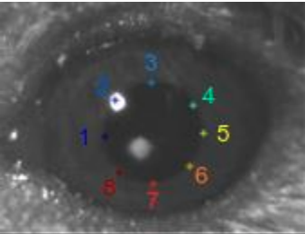
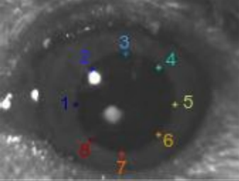
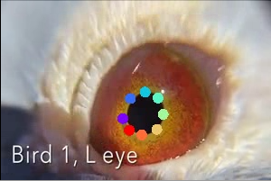
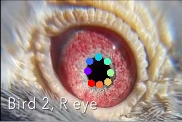
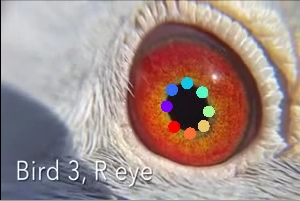
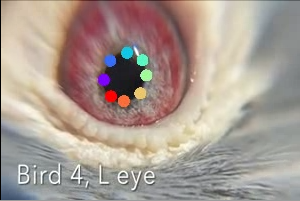
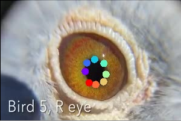
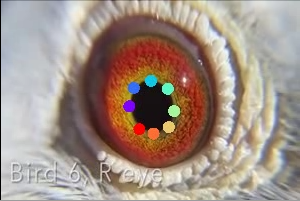
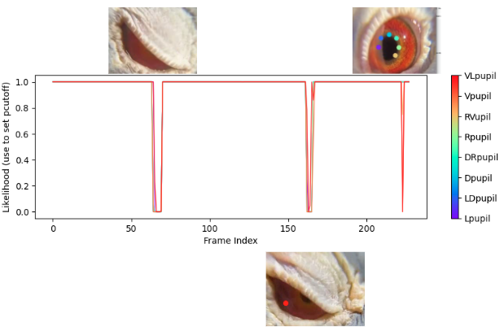

# DeepLabCut ModelZoo

<p style='text-align: justify;'>Animal behavior has to be analyzed with painstaking accuracy. Therefore, animal pose estimation has been an important tool to study animal behavior precisely. 

Beside providing an open source toolbox to researchers markerlessly track their animals, DeepLabCut also aims to constitute the generalization of models of unseen animals. [Here](http://www.mackenziemathislab.org/dlc-modelzoo) you can check model weights that are trained on specific animals and scenarios. You can analyze your videos directly with these models without training. The models have strong zero-shot performance on unseen out-of-domain data which can be further improved via pseudo-labeling. Please check the first <a href="https://arxiv.org/abs/2203.07436v1" target="_blank">Model Zoo manuscript</a> for further details.

This recipe aims to show a usecase of "**mouse_pupil model**". </p>

# Mouse_pupil model

This model was contributed by Jim McBurney-Lin at University of California Riverside, USA.

The model was trained on images of C57/B6 mice eyes (exclusively the left eye). 


 

| Landmark_Number  | Landmark_Name  | Description|
| --- | --- | --- |
| 1 | Lpupil  | Left aspect of pupil |
| 2 | LDpupil | Left/dorsal aspect of pupil |
| 3 | Dpupil  | Dorsal aspect of pupil |
| 4 | DRpupil  | Dorsal/Right aspect of pupil |
| 5 | Rpupil  | Right aspect of pupil |
| 6 | RVpupil  | Right/ventral aspect of pupil |
| 7 | Vpupil  | Ventral aspect of pupil |
| 8 | VLpupil  | Ventral/left aspect of pupil |


Since we would like to evaluate the model on out-of-domain data, we will analyze pigeon pupils.

# Pigeon Pupil

The eye pupil admits and regulates the amount of light entering the retina in order to enable image perception. Beside this curicial role, the pupil also reflects the state of the brain. The systemic behavior of the pupil has not been vastly studied in birds, although researchers from <a href="https://www.sciencedirect.com/science/article/pii/S0960982221013166?via%3Dihub" target="_blank">Max Planck Institute for Ornithology in Seewiesen</a> have shed light on pupil behaviors in pigeons.

The pupils of male pigeons get smaller during courtship behavior. This is in contrast to mammals, for which the pupil size dilates in response to an increase in arousal. In addition, the pupil size of pigeons dilates during non-REM sleep, while they rapidly constrict during REM sleep. Examining these differences and the reason behind them, might be helpful to understand the pupillary behavior in general.

In light of these findings, we wanted to show whether the **Mouse_pupil model** give us an accurate tracking performance for the pigeon pupil as well.

## Jupyter & Google Colab Notebook

DeepLabCut provides a Google Colab Notebook to analyze your video with a pretrained networks from the ModelZoo. No need for local installation of DeepLabCut!

Since we are interested in the accuracy of the **Mouse_pupil model** on pigeon pupil data, we will use a video which consits of 7 recordings of pigeon pupils. 

Check <a href="https://colab.research.google.com/github/DeepLabCut/DeepLabCut/blob/master/examples/COLAB/COLAB_DLC_ModelZoo.ipynb" target="_blank">ModelZoo Colab page</a> and a video tutorial on how to use the ModelZoo on Google Colab. 

<div align="center">
  <a href="https://www.youtube.com/watch?v=twHBa1ZvXM8" target= "_blank"></a>
</div>

```{hint}
You are happy with the model and want to go on analyzing further videos on your local machine or you want to refine the model for your specific usecase? 
```html
!zip -r /content/file.zip /content/pigeon_modelZoo-nessi-2022-08-22 
from google.colab import files
files.download("/content/file.zip")```

```

## Analyze Videos at Your Local Machine

DeepLabCut host models from the <a href='http://www.mackenziemathislab.org/dlc-modelzoo' target="_blank">DeepLabCut ModelZoo Project</a>.

The `create_pretrained_project` function will create a new project directory with the necessary sub-directories and a basic configuration file. 
It will also initiliaze your project with a pre-trained model from the DeepLabCut ModelZoo.

The rest of the code should be run within your DeepLabCut environment. 
Check <a href='https://deeplabcut.github.io/DeepLabCut/docs/intro.html' target="_blank">here</a> for the instructions for the DeepLabCut installation. 


```python
import deeplabcut
```
To initiliaze a new project directory with a pre-trained model from the DeepLabCut ModelZoo, run the code below.

```python
deeplabcut.create_pretrained_project(
    "projectname",
    "experimenter",
    r"path_for_the_videos",
    model= "mouse_pupil_vclose",
    working_directory= r"project_directory",
    copy_videos= True,
    videotype= ".mp4 or .avi?",
    analyzevideo= True,
    filtered= True,
    createlabeledvideo= True,
    trainFraction= None
)
```
::::{important}
Your videos should be cropped around the eye for better model accuracy! 👁🐭
::::

We have been lucky that 6 out of the 7 pigeon pupils tracked nicely:



When we further evaluate the model accuracy by checking the likelihood of tracked points, we see that the tracking fails when the pigeons close their eyelid (which is of course expected).



But you also might encounter bigger problems than just some small tracking glitches:

```{image} ../images/pigeon_7.png
:alt: fishy
:class: bg-primary mb-1
:width: 350px
:align: center
```
To deal with this, you can extract poorly tracked outlier frames, refine them and feed the training data set with them for re-training. 
Be sure that you set the number of frames to label in the `config.yaml` file of your project folder.
The more problems you encounter, the higher the number of frames you might want to label.
You should also add the path of the video(s) into the `config.yaml` file, or run the following command to add the videos to your project:

```python
deeplabcut.add_new_videos('/pathofproject/config.yaml', ['/pathofvideos/pigeon.mp4'], copy_videos=False, coords=None, extract_frames=False)
```
The `deeplabcut.extract_outlier_frames` function will check for outliers and ask your feedback on whether to extract these outliers frames. 

```python
deeplabcut.extract_outlier_frames('/pathofproject/config.yaml', ['/pathofvideos/pigeon.mp4'], automatic=True)
```
The `deeplabcut.refine_labels` function starts the GUI which allows you to refine the outlier frames manually. 
You should load the outlier frames directory and corresponding `.h5` file from the previous model. 
It will ask you to define the `likelihood` threshold: labels under the threshold should be refined at this stage. 

After refining, you should combine these data with your previous model's data set and create a new training data set.
```python
deeplabcut.refine_labels('/pathofproject/config.yaml')
deeplabcut.merge_datasets('/pathofproject/config.yaml')
deeplabcut.create_training_dataset('/pathofproject/config.yaml')
```
Before starting the training of your model, there is one last step left: editing the `init_weights` parameter in your `pose_cfg.yaml` file. 
Go to your project and check the latest snapshot (e.g., `snapshot-610000`) of your model in `dlc-models/train` directory. 
Edit the value of the `init_weights` key in the `pose_cfg.yaml` file and start to re-train your model! 


`init_weights: pathofyourproject\dlc-models\iteration-0\DLCFeb31-trainset95shuffle1\train\snapshot-610000`

```python
deeplabcut.train_network('/pathofproject/config.yaml', shuffle=1, saveiters=25000)
```
```{hint}
Check this video for model refining!
<div align="center">
  <a href="https://www.youtube.com/watch?v=bgfnz1wtlpo" target="_blank"></a>
</div>
```